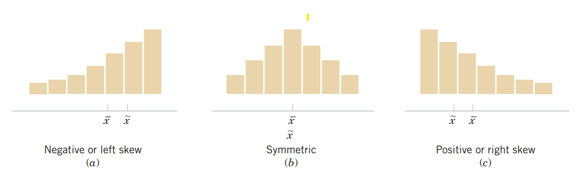

# Introduction to statistics and Data analysis

The field of **statistics** deals with the collection, presentation, analysis, and use of data to make decisions, solve problems, and design products and processes. In simple terms, **statistics is the science of data**.

Because many aspects of engineering practice involve working with data, obviously knowledge of statistics is just as important to an engineer as are the other engineering sciences.

Specifically, statistical techniques can be powerful aids in designing new products and systems, improving existing designs, and designing, developing, and improving production processes.

Statistical methods are used to help us describe and understand **variability**. By variability, we mean that successive observations of a system or phenomenon do not produce the same result. We all encounter variability in our everyday lives, and **statistical thinking** can give us a useful way to incorporate this variability into our decision-making processes [@montgomery2014a].

There are two types of data sets you will use when studying statistics. These data sets are called **populations** and **samples**.

A **population** is the collection of all outcomes, responses, measurements, or counts that are of interest.\
A **sample** is a subset, or part, of a population.

Two important terms that are used throughout this course are ***parameter*** and ***statistic***.

A ***parameter*** is a numerical description of a *population characteristic*.\
A ***statistic*** is a numerical description of a *sample characteristic*.

**Data** refers to a collection of facts, measurements, observations, or information that is gathered to be analyzed and used for decision-making, understanding patterns, or testing hypotheses.

These facts can represent various forms of information, such as numbers, words, measurements, or even categories.

**Types of data**

**Quantitative Data (Numerical Data)**

- Data that represents numerical values.

- Example: Heights of people, temperatures, test scores.

- Subtypes:

  - **Discrete Data**: Countable values (e.g., number of students in a class).

  - **Continuous Data**: Measurable values that can take any value within a range (e.g., weight, time).

**Qualitative Data (Categorical Data)**

- Data that represents categories or labels.

- Example: Colors of cars, types of animals, survey responses (e.g., yes/no).

- Subtypes:

  - **Nominal Data**: Categories without a natural order (e.g., gender, blood type).

  - **Ordinal Data**: Categories with a meaningful order (e.g., rankings, education levels).

**Collecting Engineering Data**

In the previous subsection, we illustrated some simple methods for summarizing data. Sometimes the data are all of the observations in the population. This results in a **census**. However, in the engineering environment, the data are almost always a **sample** that has been selected from the population. Three basic methods of collecting data are

\(i\) A **retrospective study** using historical data (ii) An **observational study** (iii)A **designed experiment**

An effective data-collection procedure can greatly simplify the analysis and lead to improved understanding of the population or process that is being studied. We now consider some examples of these data-collection methods. (For detail, *see* @montgomery2014a **, Chapter 1**)

The study of statistics is divided into two parts- **Descriptive statistics** and **Inferential statistics**.

**Descriptive statistics** is the branch of statistics that involves the organization, summarization, and display of data.\
**Inferential statistics** is the branch of statistics that involves using a sample to draw conclusions about a population.

A basic tool in the study of inferential statistics is **probability** and **probability distribution**s.

The goal of inferential statistics is to draw conclusions from a sample and generalize them to the population. The most common methodologies used are hypothesis tests, Analysis of variance, etc.\
\
We will begin with **descriptive statistics.**

## Descriptive statistics

An important aspect of dealing with data is organizing and summarizing the data in ways that facilitate its interpretation and subsequent analysis. This aspect of statistics is called **descriptive statistics**. Usually, data are summarized both **numerically** and **graphically**.  In this module, our focus will be concentrated on the following topics:

\(i\) Numerical Summaries of Data (ii) Graphical summaries (Histogram and  Box Plot)

**Numerical summaries of the data**

Often to summarize data we use some numerical measures like measures of central tendency, measures of location and measures of variation. The common numerical summaries are:

| 1\) Measures of central tendency | 2\) Measures of relative standing: Quantile | 3\) Measures of variability |
|----|----|----|
| Mean/ Arithmetic mean/average, Median, Mode etc | a)Percentiles, Quartiles etc. | a\) Range, Inter-quartile range (IQR), Variance and standard deviation, Coefficient of variation (CV)% etc. |

While studying these numerical summaries, we consider **sample data**.

## Measures of central tendency and quantile

### Mean

- **Sample mean:** Suppose $n$ observation of a variable $X$ is drawn from a population. Then the sample mean is denoted by $\bar x$ and

  $$\bar x =\frac{\sum x}{n}$$

  The sample mean $\bar x$ is a sample statistic.

- **Population mean:** Suppose in a population there are $N$ values of variable $X$. Then the population mean is denoted by $\mu$ and

  $$\mu =\frac{\sum x}{N}$$

  The $\bar x$ is a point estimator of the population mean $\mu$.

**Example 1.1:** Eight prototype units are produced and their pull-off forces measured, resulting in the following data (in pounds): 12 .6, 12. 9, 13. 4, 12. 3, 13. 6, 13 .5, 12. 6, 13. 1.

Suppose,$X=$pull-off forces (in pounds). So,

$X=\{x_1,x_2,...,x_8\}=\{12.6,12.9,…,13.1\}$

The sample mean is, pounds

$$\bar x=\frac{\sum x}{n}=\frac{12.6+12.9+...+13.1}{8}=\frac{104}{8}=13.0 \ \ pounds$$

### Median

The **median** is another measure of central location. The median is the value in the middle when the data are arranged in ascending order (smallest value to largest value).

- For an *odd* number of observations, median is the **middle** **value**

- For an *even* number of observations, median is the **average of the two middle values**

**Example 1.2:** CPU time of 9 jobs (in seconds):\
Data: 59, 139, 46, 37, 42, 30, 55, 56, 82\
**Arranged/sorted data:** 30, 37, 42, 46, 55, 56, 59, 82, 139\
**Median=55**; whereas the **Mean=60.67**

**Example 1.3 :** CPU time of 10 jobs (in seconds): 59, 139, 46, 37, 42, 30, 55, 56, 36, 82\
**Arranged/sorted data:** 30, 36, 37, 42, 46, 55, 56, 59, 82, 139.

**Median** = (46+55)/2=50.5; whereas **Mean**=58.2.

::: callout-note
Notice that the median is unaffected by the size of the largest CPU time. It impiles that, mean is affected by extreme value or outlier but median is not.
:::

### **Mode**

is the most frequently occurring data value.

### Percentiles

Percentiles divide the whole data set into approximately 100 equal parts. So, there are 99 percentiles -$P_1, P_2,...,P_{99}$. In this lecture $j^{th}$ percentile will be denoted by $P_j$ .

We can compute the $j^{th}$ percentile as follows:

$$P_j=(j*\frac{n+1}{100})^{th} \ \ value; \ \ j=1,2,...,99.$$

**Example 1.4:** Compute the 25^th^ and 60^th^ percentile from the following data:

CPU time of 9 jobs (in seconds): 59, 46, 37, 42, 30, 55, 56, 36, and 82.

[*Solution:*]{.underline} Here, $n=9$.

**Sorted data:** 30, 36, 37, 42, 46, 55, 56, 59, and 82.

So, $P_{25}=(25*\frac{9+1}{100})^{th} \ \ value=2.5^{th} \ \ value$

$=2^{nd} \ \ value +0.5(3^{rd}-2^{nd})=36+0.5(37-36)=36.5$.

[Interpretation:]{.underline} $P_{25}=36.5$ implies that approximately 25% of the total observations lie below or equal to 36.5.

Similarly, $P_{60}=(60*\frac{9+1}{100})^{th}\ \ value=6^{th}\ \ value=55$.

[Interpretation:]{.underline} $P_{60}=55$ implies that approximately 60% of the total observations lie below or equal to 55.

### Quartiles

It is often desirable to divide data into four parts, with each part containing approximately one-fourth, or 25% of the observations. The division points are referred to as the quartiles and are defined as

*Q~1~* = first quartile, or 25^th^ percentile

*Q*~2~ = second quartile, or 50^th^ percentile (also the median)

*Q*~3~ = third quartile, or 75^th^ percentile.

**Example 1.5:** Here is the monthly starting salary (\$) of 12 graduates:

3450, 3550, 3650, 3480, 3355, 3310, 3490, 3730, 3540, 3925, 3520, 3480

Compute Q1 and Q3 of the above data (*Will be solved in class*).

## Measures of variability

Variability in data means lack of uniformity. It is also referred to as spread, scatter, or dispersion. We turn now to a discussion of some commonly used measures of variability.

### Range

$$Range=Largest \ \ value-Smallest \ \ value $$

- Heavily influenced by extreme values

### Inter-quartile-range (IQR)

$$IQR=Q_3-Q_1$$

- It exhibits the variability in the middle 50% of the observations.

- The interquartile range is less sensitive to the extreme values in the sample than is the ordinary sample range.

**Detection of outliers using 1.5(IQR) rule**

In this method, we discuss fences***.***

- The lower fence of distribution is 𝒍𝒐𝒘𝒆𝒓 𝒇𝒆𝒏𝒄𝒆, $lf=Q_1-1.5(IQR)$

- The upper fence of distribution is 𝒖𝒑𝒑𝒆𝒓 𝒇𝒆𝒏𝒄𝒆, $uf=Q_3+1.5(IQR)$

- If any value lies outside the interval $[lf,uf]$; then it will be considered an outlier.

**Example 1.6:** The following data set represents the number of new computer accounts registered during ten consecutive days.  43, 37, 50, 51, 58, 105, 52, 45, 45, 10. Check for outliers using the 1.5(IQR) rule.

### Variance and standard deviation

The variability or scatter in the data around mean may be described by the variance and standard deviation.

- **Population variance:** If $x_1, x_2, ...,x_N$ is a *population* of $N$ observations , the population variance is

  $$\sigma^2=\frac{(x_1-\mu)^2+(x_2-\mu)^2+...+(x_N-\mu)^2}{N}$$

  $$=\frac{\sum_{i=1}^N (x_i-\mu)^2} {N}=\frac{\sum_{i=1}^N x_i^2}{N}-\mu^2$$

- **Sample variance:** If $x_1, x_2, ...,x_n$ is a *sample* of $n$ observations , the sample variance is

$$s^2=\frac{(x_1-\bar x)^2+(x_2-\bar x)^2+...+(x_n-\bar x)^2}{n-1}=\frac{\sum_{i=1}^n (x_i-\bar x)^2} {n-1}$$

- An alternative formula for the computation of the sample variance is:

$$s^2=\frac{\sum x_i^2-n\bar x^2}{n-1}$$
where, $\sum x_i^2=x_1^2+x_2^2+...+x_n^2$

**Example 1.7:** Eight prototype units are produced and their pull-off forces measured, resulting in the following data (in pounds): 12 .6, 12. 9, 13. 4, 12. 3, 13. 6, 13 .5, 12. 6, 13. **Compute** sample variance.

[Solution:]{.underline}

```{r}
library(tidyverse)

pulloff<-c(12.6,12.9, 13.4, 12.3, 13.6, 13.5, 12.6, 13.1)
#sum(pulloff)/8
#sum(pulloff^2)
#mean(pulloff)

pulldf<-as.data.frame(pulloff)

pulldf %>% mutate(m=mean(pulloff),deviation=pulloff-m,sqrd_dev=deviation^2)->vartab
#sum(vartab$sqrd_dev)
```

| Pull-off force($x_i$) | Sample mean, $\bar x$ | $(x_i-\bar x)$ | $(x_i-\bar x)^2$ |
|:--:|:--:|:--:|:--:|
| 12.6 | 13 | -0.4 | 0.16 |
| 12.9 | 13 | -0.1 | 0.01 |
| 13.4 | 13 | 0.4 | 0.16 |
| 12.3 | 13 | -0.7 | 0.49 |
| 13.6 | 13 | 0.6 | 0.36 |
| 13.5 | 13 | 0.5 | 0.25 |
| 12.6 | 13 | -0.4 | 0.16 |
| 13.1 | 13 | 0.1 | 0.01 |
|  |  | $\sum (x_i-\bar x ) =0$ | $\sum (x_i-\bar x )^2 =1.6$ |

: Computation of the sample variance for the pull-off force data

$$s^2=\frac{\sum (x_i-\bar x)^2}{n-1}=\frac{1.6}{8-1}=0.2286 \ \ (pounds)^2 $$

[Alternative:]{.underline} Here $\sum x^2 =12.6^2+12.9^2+\cdot \cdot\cdot+13.1^2=1353.6$

$\bar x=13$

So, $s^2=\frac{\sum x^2-n\times \bar x^2}{n-1}=\frac{1353.6-8\times (13^2)}{8-1}=0.2285714\approx 0.2286 \ \ (pounds)^2$

**Standard deviation**

The **standard deviation** is defined to be the positive square root of the variance

- **Sample standard deviation=**$s=\sqrt {s^2}$

- **Population standard deviation=**$\sigma =\sqrt {\sigma ^2}$

> *The sample standard deviation* $s$ *is the estimator of population standard deviation* $\sigma$*.*

**Example 1.8:** The standard deviation of the previous example is :

$$ s=\sqrt {0.2286} \approx0.48 \ \ pounds$$

::: callout-note
## Note:

The standard deviation is easier to interpret than the variance because the standard deviation is measured in the same units as the data.
:::

For example, the sample variance for the pull-off force data of prototype units is $s^2=0.2286 \ \ (pounds)^2$.

Because the standard deviation is the square root of the variance, the units of the variance, pounds squared, are converted to pound in the standard deviation.

Thus, the standard deviation of the pull-off force data is 0.48 pounds. In other words, the standard deviation is measured in the same units as the original data. For this reason the standard deviation is more easily compared to the mean and other statistics that are measured in the same units as the original data.

### Coefficient of variation

In some situations we may be interested in a descriptive statistic that indicates how large the standard deviation is relative to the mean. This measure is called the **coefficient of variation** and is usually expressed as a percentage.

**Coefficient variation,**

$$CV=\frac{Standard \ \ deviation}{Mean}$$

- The coefficient of variation is a relative measure of variability; it measures the standard deviation relative to the mean.

- In general, the coefficient of variation is a useful statistic for comparing the variability of variables that have different standard deviations and different means.

**Example 1.9:** The table at the left shows the population heights (in inches) and weights (in pounds) of the members of a basketball team. Find the coefficient of variation for the heights and the weights. Then compare the results.

::: panel-tabset
## Data

| **Heights (inches)** | **Weights (pounds)** |
|:--------------------:|:--------------------:|
|          72          |         180          |
|          74          |         168          |
|          68          |         225          |
|          76          |         201          |
|          74          |         189          |
|          69          |         192          |
|          72          |         197          |
|          79          |         162          |
|          70          |         174          |
|          69          |         171          |
|          77          |         185          |
|          73          |         210          |

## Coefficient of variation

The mean height $\mu \approx 72.8 \ \ inches$ with a standard deviation $\sigma =3.3 \ \ inches$.

The coefficient of variation for the heights is

\
$CV_{height}=\frac{\sigma}{\mu}.100\%=\frac{3.3}{72.8} . 100\% \approx 4.5\%$.

The mean weight $\mu \approx 187.8 \ \ pounds$ with a standard deviation $\sigma =17.7 \ \ pounds$.

The coefficient of variation for the weights is

$CV_{weight}=\frac{\sigma}{\mu}.100\%=\frac{17.7}{187.8}.100\% \approx9.4\%$

***Interpretation*** The weights (9.4%) are more variable than the heights (4.5%).
:::

## Graphical summary/visualization

Before diving into advanced analysis we should have a look at the data. Because " A picture is worth a thousand words". Often a summary of a collection of data via a graphical display can provide insight regarding the system from which the data were taken.

### Frequency Distributions and Histograms

To construct a frequency distribution, we must divide the range of the data into intervals, which are usually called **class intervals, cells**, or **bins,** and count how many observations fall into each **bin**.

The **histogram** is a visual display of the frequency distribution.

- A **frequency histogram** consists of columns, one for each **bin**, whose height is determined by the **number** of observations in the **bin**. \[Frequency distribution\]

- A **relative frequency histogram** has the same shape but a different vertical scale. Its column heights represent the **proportion** of all data that appeared in each bin. \[Relative frequency distribution\]

What is the appropriate size of **bins?**

There are several rules, but one of them is, the number of bins, suppose $k=\sqrt n$. We will discuss how to construct a frequency distribution, relative frequency distribution, and cumulative frequency distribution in the following example.

**Example 1.10:** The following data are the joint temperatures of the O-rings (°F) for each test firing or actual launch of the space shuttle rocket motor (from *Presidential Commission on the Space Shuttle Challenger Accident*, Vol. 1, pp. 129–131):

> 67, 40, 58, 76, 58, 70, 72, 67, 75, 70, 57, 83, 53, 45, 70, 81, 78, 76, 67, 73, 61, 52, 31, 67, 79, 75, 69, 84, 68, 80

**To construct frequency distribution and others follow the steps:**

**Step-1:** Find the **number bins**, $k=\sqrt n=\sqrt 30=5.48\approx 6$ (round to nearest integer).

**Step-2:** Find the range of the data, $R=Maximum-Minimum=84-31=53$

**Step-3:** Determine **bin width**, $w=\frac{R}{k}=\frac{53}{6}=8.83 \approx 10$

**Step-4:** Define the **bins** in ***exclusive*** method, starting from a suitable data value close to lowest value, for example **\[30, 40), \[40, 50), and so on** until we have the highest data value.

**Step-5:** Now count the observation fall in each bin, using tally.

+--------------+------------------------------+---------------+-------------------------+---------------------------+
| Temperatures | Tally                        | Frequency (f) | Relative frequency (rf) | Cumulative frequency (cf) |
|              |                              |               |                         |                           |
| (in ^o^ F)   |                              |               |                         |                           |
+:============:+:============================:+:=============:+:=======================:+:=========================:+
| \[30,40)     | \|                           | 1             | 0.03                    | 1                         |
+--------------+------------------------------+---------------+-------------------------+---------------------------+
| \[40,50)     | \|\|                         | 2             | 0.07                    | 3                         |
+--------------+------------------------------+---------------+-------------------------+---------------------------+
| \[50,60)     | ~~\|\|\|\|~~                 | 5             | 0.17                    | 8                         |
+--------------+------------------------------+---------------+-------------------------+---------------------------+
| \[60,70)     | ~~\|\|\|\|~~ \|\|            | 7             | 0.23                    | 15                        |
+--------------+------------------------------+---------------+-------------------------+---------------------------+
| \[70,80)     | ~~\|\|\|\|~~ ~~\|\|\|\|~~ \| | 11            | 0.37                    | 26                        |
+--------------+------------------------------+---------------+-------------------------+---------------------------+
| \[80,90)     | \|\|\|\|                     | 4             | 0.13                    | 30                        |
+--------------+------------------------------+---------------+-------------------------+---------------------------+
| **Total**    |                              | n=30          | 1.00                    |                           |
+--------------+------------------------------+---------------+-------------------------+---------------------------+

: Frequency, Relative frequency, Cumulative frequency Distribution for the O-rings temperature data (n=30)

### **Histogram**

**The histogram** provides a visual impression of the **shape** of the distribution of the measurements and information about the **central tendency** and scatter or **dispersion** in the data.

The histogram from the previous example is shown in @fig-fig21:

```{r}
#| label: fig-fig21
#| fig-cap: "Frequency histogram of temperature (°F)"

fd.data<-c(67, 40, 58, 76, 58, 70, 72, 67, 75, 70, 57, 83, 53, 45, 70, 81, 78, 76, 67, 73, 61, 52, 31, 67, 79, 75, 69, 84, 68, 80)

#summary(fd.data)

hist(fd.data,main = "",
     xlab = "Temperature  (°F)",
     labels = TRUE,ylim=c(0,12), right = FALSE,col = "#a2d2ff")

```

**Histogram and shape of the distribution**

When the sample size is large, the histogram can provide a reasonably reliable indicator of the general **shape** of the distribution or population of measurements from which the sample was drawn. (for detail *see* @montgomery2014a ).

{#fig-fig22}

### Box-plot

The **box plot** is a graphical display that simultaneously describes several important features of a data set, such as *center*, *spread*, departure from *symmetry*, and identification of unusual observations or *outliers*.

A box plot, sometimes called *box-and-whisker plots*, displays the **three quartiles**, **the minimum/lower fence**, and **the maximum/upper fence** of the data on a rectangular box, aligned either horizontally or vertically.

If any value falls outside the **fences** then it will shown as a **circle** in the box-plot.

**Example 1.11**

::: panel-tabset
## Variable-I

Suppose, X={10,15,14,18,17,12,16,15,19,21,32,12,58}

```{r}
X=c(10,15,14,18,17,12,16,15,19,21,24,12,11)
boxplot(X, horizontal = T, main="Box-plot of variable X", col = "#b5e2fa")
```

## Variable-II

Suppose, Y={5,8,14,15,18,17,16,14,15,21,21,35,17,16,20}

```{r}
Y=c(5,8,14,15,18,17,16,14,15,21,21,26,17,16,20)
boxplot(Y,horizontal = T,main="Boxplot of variable Y",pch=19,col = "#b5e2fa")
```
:::

### Boxplot and skewness of the data

When we discuss the frequency histogram we also learned about shape of the distribution. By visual inspection of boxplot we can also tell about the distribution shape of a variable. The following boxplots are the typycal examples of skewness of the data.

```{r}
library(tidyverse)
par(mar = c(7, 4, 2, 2) + 0.1)


l <- layout(matrix(c(1, 1,  # First, second
                     2, 3), # and third plot
            nrow = 2,
            ncol = 2,
            byrow = TRUE))

#layout.show(l)

set.seed(1)
x=rbeta(200,2,2)
boxplot(x,horizontal = T,xlab="Value",main="(a) Boxplot of approximately symmetric distribution")

y=rbeta(200,1,2)
boxplot(y,horizontal = T,xlab="Value",main="(b) Boxplot of positively skewed distribution",cex.main=0.9)

z=rbeta(200,4,2)
boxplot(z,horizontal = T,xlab="Value",main="(c) Boxplot of negatively skewed distribution",cex.main=0.9)


xyz<-tibble(x,y,z)
xyz %>% gather(key = "variable",value = "value")->xyz.long

#xyz.long %>% ggplot(aes(x=variable,y=value))+
  #geom_boxplot(fill="steelblue")+
  #coord_flip()+
  #theme_classic()

```

**Comparative/Parallel box-plots**

Box plots are very useful in graphical comparisons among data sets because they have high visual impact and are easy to understand.

- For instance, here the **Life expectancy at birth (in year)** of Afghanistan, Bangladesh, India and Pakistan is compared using a **comparative box-plot** from 1971 to 2007.

```{r}

library(gapminder)

#head(gapminder)
#tail(gapminder)

gapminder %>%
  filter(country==c("Afghanistan", "Bangladesh", "Pakistan","India")) %>%filter(year>=1971) %>% 
  ggplot(aes(x=country,y=lifeExp,fill=country))+
  geom_boxplot()+
  guides(fill=FALSE)+
  labs(x="Country",y="Life expectancy at birth (in year)",
       title = "Comparative box-plot of life expectancy of 4 Asian Countries: 1971-2007")+
  theme_classic()
```

**Question:** What is/are your observation(s) from this above comparative box-plot?\

## Exercises (Practice as more as you can)

**1.1 Define** statistics, population, sample, descriptive and inferential statistics.

**1.2** Define data. Discuss the types of data with example.

**1.3** What are the common measures of location? When median is preferable to mean?

**1.4** What are the common measures of variation?

**1.5 Define** five-number summary. How to detect outliers using quartiles?

**1.6** The data contains the overall gallons per kilometer (GpK) of a medium-sized mobile home unit.

35, 30, 37, 35, 34, 35, 35, 42,40, 37, 42, 38, 35, 34, 35, 34, 34.

**Calculate** and **explain** Median. **Find** the value above which 15% GpK values lie.

**1.7** In automobile mileage and gasoline-consumption testing, 13 automobiles were road tested for 300 miles in city driving conditions. The following data were recorded for miles-per-gallon (mpg) performance.

> 13.2, 14.4, 15.2, 15.3, 15.3, 15.3, 15.9, 16.0, 16.1, 16.2, 16.2, 16.7, 16.8

i)  **Construct** a simple boxplot (in horizontal direction) of mpg. Are most of the automobiles’ mpg relatively low?

ii) Suppose you want to buy a new car and you don’t afford enough money, so the car’s mileage must be in *bottom* 10%. What should be the mileage of your car based on this data?

iii) Suppose you want to buy a new car which mileage must be in *top* 10%. What should be the mileage of your car based on this data?

**1.8** The data set lists the prices (in dollars) of 20 portable global positioning system (GPS) navigators.

> 128, 100, 180, 150, 200, 90, 340, 105, 85, 270, 200, 65, 230, 150, 150, 120, 130, 80, 230, 200

i)  **Construct** a frequency distribution and percent frequency distribution of prices.

ii) **Draw** a frequency histogram. What is your observation about price data?

**1.9** The lengths of power failures, in minutes, are recorded in the following table.

> 18, 135, 15, 90, 78, 69, 98, 102, 83, 55, 28

i)  **Compute** sample mean and standard deviation

ii) **Compute** sample median and IQR

iii) If you want to be in the bottom 10% of power failures in your residence, then what should be the cutoff value of power failure lengths in minutes?

**1.10** Sample annual salaries (in thousands of dollars) for entry-level electrical engineers in Boston and Chicago are listed.

> **Boston** 70.4, 84.2, 58.5, 64.5, 71.6, 79.9, 88.3, 80.1, 69.9
>
> **Chicago** 69.4, 71.5, 65.4, 59.9, 70.9, 68.5, 62.9, 70.1, 60.9

**Find** the coefficient of variation for each of the two data sets. Then **compare** the results.

**1.11** The shear strengths of 20 spot welds in a titanium alloy are as follows:

> 5408 5431 5475 5442 5376 5388 5459 5422 5416 5435
>
> 5420 5429 5401 5446 5487 5416 5382 5357 5388 5457

**Construct** a frequency histogram of shear strength data. **Conclude** whether the shear strength is approximately symmetric or not.

**1.12** The “cold start ignition time” of an automobile engine is being investigated by a gasoline manufacturer. The following times (in seconds) were obtained for a test vehicle:

> 1.75, 1.92, 2.62, 2.35, 3.09, 3.15, 2.53, 1.91.

**Check** for outliers using the 1.5\*IQR rule of cold start ignition time.

**1.13** The cylindrical compressive strength (in MPa) was measured for 11 beams. The results were:

> 38.43, 38.43, 38.39, 38.83, 38.45, 38.35, 38.43, 38.31, 38.32, 38.48, 38.50.

**i) Construct** a simple boxplot and comment about the shape of the distribution of compressive strength.

**ii) Compute** sample mean, standard deviation and coefficient of variation (CV) compressive strength.

**1.14** The shear strengths (in N/m2) of 10 spot welds in a titanium alloy are:

5408, 5431, 5475, 5442, 5376, 5388, 5459, 5422, 5416, 5435.

**Compute** sample mean, standard deviation and coefficient of variation of shear strength.

**1.15** An article describes an experiment to test the yield strength of circular tubes with caps welded to the ends. The first 18 yields (in kN) are:

> 96, 96, 102, 102, 102, 104, 104, 108, 126,126, 128, 128, 140, 156, 160, 160, 164,170.

**Construct** a simple box-plot of yield strength. **Find** the value above which top 10% yield strength lie.

**1.16** The cylindrical compressive strength (in MPa) was measured for 11 beams. The results were:

> 38.43, 38.43, 38.39, 38.83, 38.45, 38.35, 38.43, 38.31, 38.32, 38.48, 38.50.

i)  **Compute** 1st quartile, 3rd quartile and IQR.

ii) **Check** for outlier (s).

iii) **Construct** a box-plot, **show** the outliers and **comment** about the symmetry of the distribution.

**1.17** The following sample data presents the thickness (Å) of a metal layer on 20 silicon wafers resulting from a chemical vapor deposition (CVD) process. Scientists believe that the thickness is usually normally distributed having a bell-shaped distribution for a smooth process. **Construct** a frequency histogram of metal thickness data. **Conclude** whether the process is smooth or not.

> 468, 459, 450, 453, 473, 454, 458, 438, 447, 463,
>
> 445, 466, 456, 434, 471, 437, 459, 445, 454, 423
