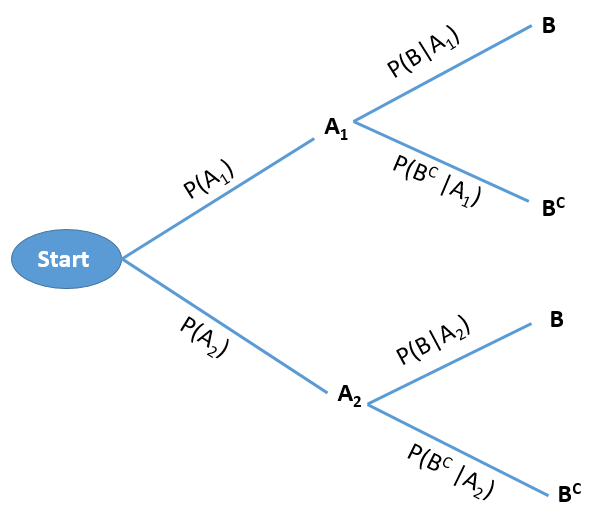
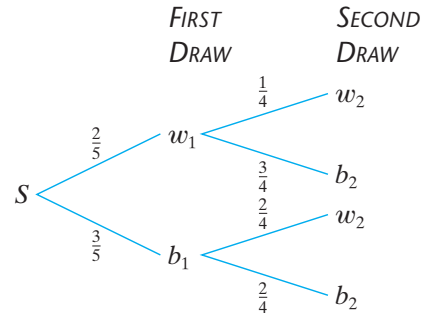
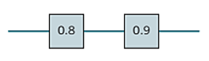
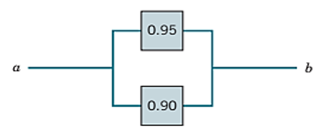
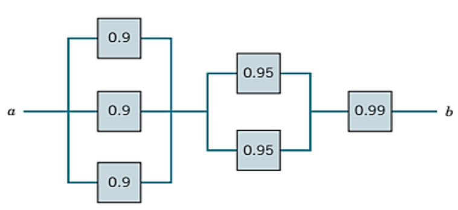
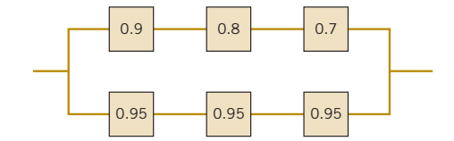
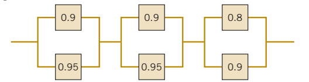
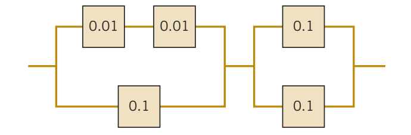
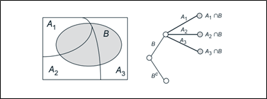
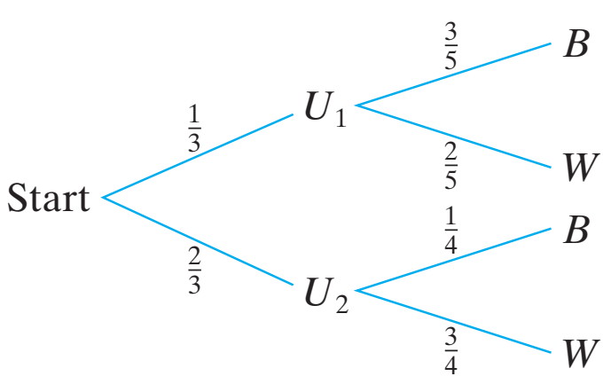

# Probability

## Introduction

A probability is the chance, or likelihood, that a particular event will occur. These are examples of events representing typical probability-type questions:

- How many customers will arrive in a super shop in next 30 minutes?

- What is probability that a stock price will rise or fall?

To answer these kind of questions in the face of uncertainty we need to study probability. To answer these type of questions which are raised in real life; at first we have to learn some basic concepts of probability.

## Random experiment

A **random experiment** is a process leading to two or more possible outcomes, without knowing exactly which outcome will occur.

**Example:** Tossing a coin, throwing a dice, change in the stock prices etc.

## Sample space

A **sample space** is the collection of all outcomes of a random experiment. The sample space is usually denoted by $S$ or Greek letter $\Omega$ (omega).

**Example 2.1:**

- If we toss a coin then the sample space is: $S=\{H,T\}$

- If we toss 2 coins then the sample space is: $S=\{HH,HT,TH,TT\}$

## Event

An **event** is a *subset* of a *sample space*.

For example suppose, $S=\{HH,HT,TH,TT\}$ and $A=\{ one \ \ head \ \ occurs  \}$. So, $A=\{ HT,TH\}$.

Since $A$ is a subset of sample space $S$, so $A$ is an *event*.

## Complement of an event

The complement of an event A with respect to Ω is the subset of all elements of $\Omega$ that are not in A. We denote the complement of A by the symbol $A^C$.

**Example 2.2:** Consider the sample space:

$\Omega =\{ 1,2,3,4,5,6\}$

Let, $A=\{1,3,5 \}$. Then the complement of $A$ is $A^C=\Omega-A=\{2,4,6\}$

## Mutually exclusive events

The occurrence of one event means that none of the other events can occur at the same time.

**Example**

- The variable “Employment status” presents mutually exclusive outcomes, *employed* and *unemployed*. An employee selected at random is either male or female but cannot be both.

- A manufactured part is acceptable or unacceptable. The part cannot be both acceptable and unacceptable at the same time.

## Axiomatic definition of Probability

The **probability** of an event $A$ is the sum of the weights of all sample points in $A$. Therefore

\(a\) $0 \le P(A)\le 1$ ; $P(\phi)=0$ and $P(\Omega)=1$.

\(b\) If $A_1, A_2,A_3,...$ is a sequence of mutually exclusive events, then

$$P(A_1\cup A_2 \cup  A_3\cup ...).=P(A_1)+P(A_2)+P(A_3)+...$$

## Probability of an event (Classical approach)

Suppose an event $A$ is defined in the sample space $\Omega$. Then the probability of event $A$ is defined as :

$$P(A)=\frac{n(A)}{n(\Omega)};$$

Here,

$n(A)=$ number of outcomes favorable to event $A$;

$n(\Omega)=$ total number of outcomes in the sample space $\Omega$.

## Probability of an event (Empirical approach)

**Empirical Probability** is a type of probability that is calculated based on actual observations, experiments, or historical data rather than theoretical assumptions. It measures the likelihood of an event occurring by analyzing past occurrences or experimental results.

**Formula for Empirical Probability:**

$$ P(E)=\frac{Number\ \ of  \ \ times \ \ the\ \  event\ \  occurs}{Total \ \ number\ \  of \ \ trials} $$

Where:

- $P(E)$ is the probability of the event $E$,

- The numerator is the count of occurrences of the event, and

- The denominator is the total number of trials or observations.

**Example 2.3:** Suppose in a class there are 30 students; 20 are male and 10 are females. If a student is selected at random what is the probability that he is a male?

[Solution:]{.underline} Let, $A_1=$ set of male students and $A_2=$ set of female students. And, $\Omega=$ set of all students

So, probability that a male student is selected is:

$$P(A_1)=\frac{n(A_1)}{n(\Omega)}=\frac{20}{30}=0.66667\approx 0.67$$

*Interpretation* There is almost $67\%$ chance that the selected student will be male.

**Example 2.4:** If 3 books are picked at random from a shelf containing 5 novels, 3 books of poems, and a dictionary, what is the probability that

\(a\) the dictionary is selected?

\(b\) 2 novels and 1 book of poems are selected?

## Properties of Probability Laws

Probability laws have a number of properties, which can be deduced from the axioms. Some of them are summarized below.

a\) $P(A^C)=1-P(A)$ **\[complement rule\]**

b\) $P(A \cap B^C )=P(A)-P(A \cap B)$ **\[only A happens\]**

c\) $P(A \cup B)=P(A)+P(B)-P(A \cap B)$ **\[additive rule\]**

d\) $P(A^C \cap B^C )=P(A∪B)^C=1-P(A \cup B)$. **\[neither A NOR B happens\]**

**Example 2.5:** In a class 65% students prefer tea and 35% students prefer coffee. While 15% students prefer both tea and coffee. If a student is selected at random from the class **find** the probability that

i)  he/she prefers only coffee

ii) he/she prefers tea or coffee

iii) he/she prefers none (neither tea nor coffee)

**Example** All Seasons Plumbing has two service trucks that frequently need repair. If the probability the first truck is available is 0.80, the probability the second truck is available is 0.60, and the probability that both trucks are available is .30, what is the probability neither truck is available?

## Conditional Probability

The conditional probability of an event $A$, *given* an event $B$ with $P(B) > 0$, is defined by,

$$P(A|B)=\frac{P(A\cap B)}{P(B)}$$
**Example 2.6** [@walpole2017 , 9th ed., page 63]: Suppose that our sample space $\Omega$ is the population of adults in a small town who have completed the requirements for a college degree. We shall categorize them according to gender and employment status. The data are given in @tbl-tbl21.

|            | Employed | Unployed | Total |
|------------|:--------:|:--------:|:-----:|
| **Male**   |   460    |    40    |  500  |
| **Female** |   140    |   260    |  400  |
| **Total**  |   600    |   300    |  900  |

: Categorization of the Adults in a Small Town

A person is selected at random. What is the probability that the selected person is:

**(i)** a Male

**(ii)** a Female and employed

**(iii)** a Male or unemployed

**(iv)** a Male given that he is employed

## **The Multiplication Rule**

If in an experiment the events A and B can both occur, then

$$P(A\cap B)=P(A) P(B|A) ; \ \ provided \ \ P(A)>0$$

In general, assuming that all of the conditioning events (let, 3 events) have positive probability, we have

$$P(A_1\cap A_2\cap A_3)=P(A_1) P(A_2|A_1)P(A_3|A_1\cap A_2)$$

**Example 2.7 \[@walpole2017 ,** Example 2.36**\]****:** Suppose that we have a fuse box containing 20 fuses, of which 5 are defective. If 2 fuses are selected at random and removed from the box in succession without replacing the first, what is the probability that both fuses are defective?

## Probability trees

Consider a sequential experiment where in the **first stage** either $A_1$ or $A_2$ can be happened with some probabilities . And in the **second stage** event $B$ can be happened. If $B^C$ is the complement of $B$ then this experiment can be shown in the following **tree diagram.**

{fig-align="center" width="366" height="254"}

**Example 2.8:** Two balls are drawn in succession, without replacement, from a box containing 3 blue and 2 white balls .

i\) What is the probability that both balls will be white?

[Solution:]{.underline} Here, two balls are drawn in succession (one by one) without replacement. This experiment can be shown in the following tree:

{fig-align="center" width="314" height="179"}

The probability of drawing a white ball on the first draw and a white ball on the second draw (both are white) is:

$P(w_1\cap w_2)=P(w_1) P(w_2|w_1)=(\frac {2}{5}) (\frac {1}{4})=\frac {1}{10}$

ii\) What is the probability that the second ball is white?

[Solution:]{.underline}

$P(w_2)=P(w_1\cap w_2)+P(b_1\cap w_2)$

$=P(w_1)P(w_2|w_1)+P(b_1)P(w_2|b_1)$

$=(\frac{2}{5})(\frac{1}{4})+(\frac{3}{5})(\frac{2}{4})=\frac{1}{10}+\frac{3}{10}=\frac{4}{10}=\frac{2}{5}$

**\*Example 2.9 \[@walpole2017,** Example 2.37**\]****:** One bag contains 4 white balls and 3 black balls, and a second bag contains 3 white balls and 5 black balls. One ball is drawn from the first bag and placed unseen in the second bag. What is the probability that a ball now drawn from the second bag is black? *(**Hints:** Apply probability tree)*

**Example 2.10-Radar Detection** [@bertsekas2008] **:** If an aircraft is present in a certain area, radar detects it and generates an alarm signal with probability 0.99. If an aircraft is not present the radar generates a (false) alarm, with probability 0.10. We assume that an aircraft is present with probability 0.05. What is the probability of no aircraft presence and a false alarm? What is the probability of aircraft presence and no detection?

## Independent events

If two events A and B are independent, the probability that both of them occur is equal to the product of their individual probabilities i.e.

$$P(A\cap B)=P(A) P(B)$$

- **Corollary:** If A and B are independent events then their complement events also be independent that is,

$$P(A^C\cap B^C)=P(A^C) P(B^C)$$

- **Independence Rule for Multiple events:**

$$P(A\cap B \cap C )=P(A) P(B) P(C) $$

**Example 2.11** [@probabil2017a, Exercise 2.89] A town has two fire engines operating independently. The probability that a specific engine is available when needed is 0.96.

\(a\) What is the probability that neither is available when needed?

\(b\) What is the probability that a fire engine is available when needed?

**Example** [@lind2012, page 182] You take a trip by air that involves three independent flights. If there is an 80 percent chance each specific leg of the trip is done on time, what is the probability all three flights arrive on time?

**Example** [@lind2012, page 182] The probability a HP network server is down is .05. If you have three independent servers, what is the probability that at least one of them is operational?

**Example** [@lind2012, page 182] Twenty-two percent of all liquid crystal displays (LCDs) are manufactured by Samsung. What is the probability that in a collection of three independent LCD purchases, at least one is a Samsung?

## System Reliability [@montgomery2014b, page 38]

- **Series circuit:** Suppose component $L$ and $R$ are connected in series from left to right . Also assume $L$ and $R$ operate ( or fail ) independently.

{fig-align="center" width="231"}

The probability that the circuit operates is

$$P(L \ \ and \ \ R)=P(L \cap R)=P(L)P(R)=0.8*0.9=0.72$$

***Practical interpretation:*** Notice that the probability that the circuit operates degrades to approximately 0.7 when all devices are required to be functional. The probability that each device is functional needs to be large for a circuit to operate when many devices are connected in series.

- **Parallel circuit:** The following circuit operates only if there is a path of functional devices from left to right. The probability that each device functions is shown on the graph. Assume that devices fail independently. What is the probability that the circuit operates?

{fig-align="center" width="309"}

Let $T$ and $B$ denote the events that the top and bottom devices operate, respectively. There is a path if at least one device operates. The probability that the circuit operates is

$$P(T \ \ or \ \ B) =P(T\cup B)=1-P(T^C \cap B^C)$$

$$=1-P(T^C)P(B^C)=1-(0.05)(0.10)=1-0.005=0.995$$

***Practical Interpretation:*** Notice that the probability that the circuit operates is larger than the probability that either device is functional. This is an advantage of a parallel architecture. A disadvantage is that multiple devices are needed.

**Advance circuit** The following circuit operates only if there is a path of functional devices from left to right. The probability that each device functions is shown on the graph. Assume that devices fail independently. What is the probability that the circuit operates? (**Ans.:** 0.9865)\

{fig-align="center" width="361"}

**Example** **2.12:** The following circuit operates if and only if there is a path of functional devices from left to right. The probability that each device functions is as shown. Assume that the probability that a device is functional does not depend on whether or not other devices are functional. What is the probability that the circuit operates? (**Ans.:** 0.9293)

{fig-align="center" width="384"}

**Example 2.13:** The following circuit operates if and only if there is a path of functional devices from left to right. The probability that each device functions is as shown. Assume that the probability that a device is functional does not depend on whether or not other devices are functional. What is the probability that the circuit operates? (**Ans.:** 0.9702)

{fig-align="center" width="384"}

**\*Example 2.14:** The following circuit operates if and only if there is a path of functional devices from left to right. Assume devices fail independently and that the probability of *failure* of each device is as shown. What is the probability that the circuit operates?

{fig-align="center" width="350"}

## Total Probability Theorem and Bayes’ Rule

In this section, we explore some applications of conditional probability. We start with the following theorem, which is often useful for computing the probabilities of various events, using a “divide-and-conquer” approach.

### Total Probability Theorem

Let $A_1,...,A_n$ be disjoint events that form a partition of the sample space (each possible outcome is included in one and only one of the events $A_1, . . . , A_n$) and assume that $P(A_i) > 0$, for all $i = 1,...,n$. Then, for any event $B$, we have

{fig-align="center" width="539"}

$$P(B)=P(A_1\cap B)+P(A_2\cap B)+....+P(A_n\cap B)$$

$$=P(A_1)P(B|A_1)+P(A_2)P(B|A_2)+....+P(A_n)P(B|A_n)$$

**Example 2.15:** Suppose that $A_1, A_2, A_3$, and B are events where $A_1$, $A_2$, and $A_3$ are mutually exclusive and $P(A_1) =0.2, P(A_2) =0.5, P(A_3) =0.3$. Also given $P(B| A_1)=0.02, P(B|A_2)=0.05, P(B|A_3)=0.04$. Find $P(B)$.

### Bayes' Rule/Theorem

Let $A_1,A_2,...,A_n$ be disjoint events that form a partition of the sample space, and assume that $P(A_i) > 0$, for all $i$. Then, for any event $B$ such that $P(B) > 0$, we have

$$P(A_i|B)=\frac{P(A_i \cap B)}{P(B)}=\frac{P(A_i)P(B|A_i)}{P(A_1)P(B|A_1)+P(A_2)P(B|A_2)+....+P(A_n)P(B|A_n)}$$

**Example 2.16** (Walpole, 9th ed, Example 2.41,page 74)**:** In a certain assembly plant, three machines, $B_1, B_2$, and $B_3$, make 30%, 45%, and 25%, respectively, of the products. It is known from past experience that 2%, 3%, and 2% of the products made by each machine, respectively, are defective. Now, suppose that a finished product is randomly selected. What is the probability that it is defective?

**Example 2.17 (**Walpole, 9th ed, Example 2.42)**:** With reference to Example 2.41, if a product was chosen randomly and found to be defective, what is the probability that it was made by machine B3?

**Example 2.18** (Walpole, 9th ed, Exercise 2.101) A paint-store chain produces and sells latex and semigloss paint. Based on long-range sales, the probability that a customer will purchase latex paint is 0.75. Of those that purchase latex paint, 60% also purchase rollers. But only 30% of semigloss paint buyers purchase rollers. A randomly selected buyer purchases a roller and a can of paint. What is the probability that the paint is latex?

**Example 2.19 (Radar Detection revisited):** If an aircraft is present in a certain area, a radar detects it and generates an alarm signal with probability 0.99. If an aircraft is not present. the radar generates a (false) alarm, with probability 0.10. We assume that an aircraft is present with probability 0.05. What is the probability of no aircraft presence and a false alarm?

i)  What is the probability that the radar generates alarm?
ii) If the radar generates alarm, what is the probability that there was an aircraft?
iii) If the radar does not generate alarm, what is the probability that there was not any aircraft?

**Example 2.20**(Montgomery, 6th ed., Exercise 2-179)**:** An e-mail filter is planned to separate valid e-mails from spam. The word free occurs in 60% of the spam messages and only 4% of the valid messages. Also, 20% of the messages are spam. Determine the following probabilities:

(a) The message contains free.
(b) The message is spam given that it contains free.
(c) The message is valid given that it does not contain free.

**Example 2.21:** One urn has 3 blue and 2 white balls; a second urn has 1 blue and 3 white balls. A single fair die is rolled and if 1 or 2 comes up, a ball is drawn out of the first urn; otherwise, a ball is drawn out of the second urn. If the drawn ball is blue, what is the probability that it came out of the first urn? Out of the second urn?

{fig-align="center" width="258"}

**\*Example** **2.22:** A binary communication channel carries data as one of two sets of signals denoted by 0 and 1. Owing to noise, a transmitted 0 is sometimes received as a 1, and a transmitted 1 is sometimes received as a 0. For a given channel, it can be assumed that a transmitted 0 is correctly received with probability 0.95 and a transmitted 1 is correctly received with probability 0.75. Also, 60% of all messages are transmitted as a 0. If a signal is sent, determine the probability that:

(a) a 1 was received;

(b) a 0 was received;

(c) an error occurred;

(d) a 1 was transmitted given that a 1 was received ;

(e) a 0 was transmitted given that a 0 was received.
