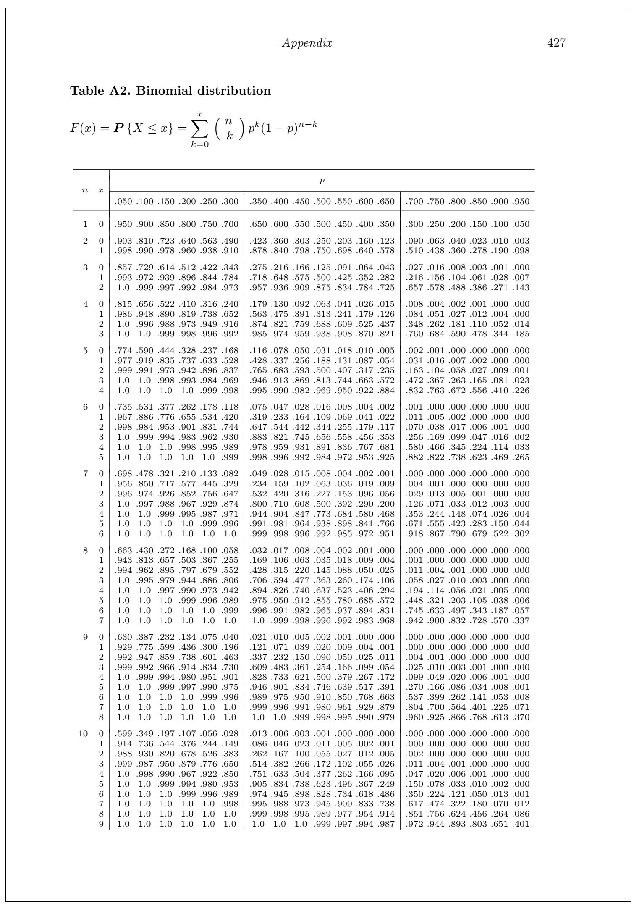
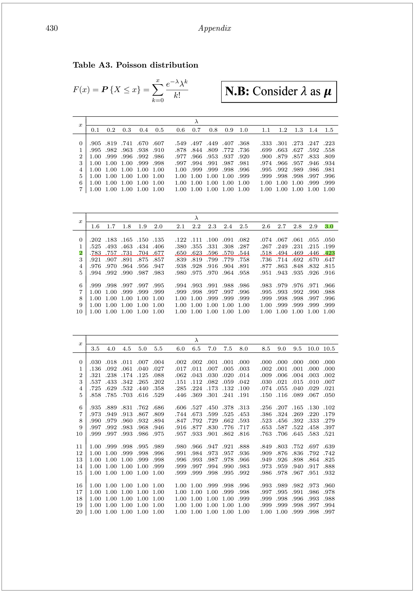

# Random variable: Discrete

In many situations, it is desirable to assign a numerical value to each outcome of a random experiment. Such an assignment is called a **random variable.**

Mathematically, a random variable is a **real-valued function** of the experimental outcome.

**Definition:** A random variable is a function that associates a real number with each element in the sample space.

::: callout-note
We shall use a capital letter, say $X$, to denote a random variable and its corresponding small letter, $x$ in this case, for one of its values.
:::

**Illustration:** Two balls are drawn in succession without replacement from an urn containing 4 red balls and 3 black balls.

- Let, $Y$ is the number of red balls.

- The small letter $y$ is the numerical value for each possible outcomes.

The possible outcomes and the values of $y$ of the random variable $Y$ are:

| **Sample space** | $y$ |
|:----------------:|:---:|
|       $RR$       |  2  |
|       $RB$       |  1  |
|       $BR$       |  1  |
|       $BB$       |  0  |

Since the values of $Y$ is determined by a random experiment so, $Y$ is a random variable (discrete).

## **Types of random variable** {#sec-types-of-random-variable}

There are two important types of random variables, **discrete** and **continuous**.

A **discrete random variable** is one whose possible values form a discrete set; in other words, the values can be ordered, and there are gaps between adjacent values. The random variable Y, just described, is discrete.

In contrast, the possible values of a **continuous random variable** always contain an interval, that is, all the points between some two numbers.

## Discrete random variable and Probability mass function

Suppose $X$ is a discrete random variable. The **probability mass function (PMF)** of $X$ can be denoted as $f(x)$ where

$$f(x)=P(X=x)$$ For each possible outcome $x$ ; $f(x)$ must satisfies:

1.  $$f(x) \ge 0$$

2.  $$\sum _x f(x)=1$$

### The Cumulative Distribution Function of a Discrete Random Variable

A function called the **cumulative distribution function (CDF)** specifies the probability that a random variable is less than or equal to a given value. The cumulative distribution function of the random variable $X$ is the function

- $F(x) = P(X \le x)$

**Example 3.1: Calculating probabilities** A certain industrial process is brought down for recalibration whenever the quality of the items produced falls below specifications. Let $X$ represent the number of times the process is recalibrated during a week, and assume that $X$ has the following probability mass function.

| $x$    |  0   |  1   |  2   |  3   |  4   |
|--------|:----:|:----:|:----:|:----:|:----:|
| $f(x)$ | 0.35 | 0.25 | 0.20 | 0.15 | 0.05 |

Compute the following :

i\) $P(X=2)$;

ii\) $P(X<3)$ and $P(X>2)$;

iii\) $F(2)$

**Example** [@walpole2017, **Example 3.8**]A shipment of 20 similar laptop computers to a retail outlet contains 3 that are defective. If a school makes a random purchase of 2 of these computers, **find** the probability distribution for *the number of defectives*.

***Solution:*** Let $X$ be a random variable whose values x are the possible numbers of defective computers purchased by the school. Then $x$ can only take the numbers 0, 1, and 2. Now ,

$P(X=0)=f(0)=P(N,N)=\frac{\binom{17}{2}\binom{3}{0}}{\binom{20}{2}}=\frac{136}{190}$

$P(X=1)=f(1)=P(D,N)=\frac{\binom{3}{1}\binom{17}{1}}{\binom{20}{2}}=\frac{51}{190}$

$P(X=2)=f(2)=P(D,D)=\frac{\binom{3}{2}\binom{17}{0}}{\binom{20}{2}}=\frac{3}{190}$

Thus, the probability distribution of X is

| $x$    |         0         |        1         |        2        |
|--------|:-----------------:|:----------------:|:---------------:|
| $f(x)$ | $\frac{136}{190}$ | $\frac{51}{190}$ | $\frac{3}{190}$ |

**Example** [@baron2019, **Exercise 3.1 (a)**] A computer virus is trying to corrupt two files. The first file will be corrupted with probability 0.4. Independently of it, the second file will be corrupted with probability 0.3.

Compute the probability mass function (**PMF**) of $X$, *the number of corrupted files*.

***Solution: (Will be discussed in class)***

### Expectation (Population Mean) of discrete random variable

Let $X$ be a discrete random variable with probability mass function $f(x) = P(X = x)$.

The mean of $X$ is given by

$$\mu=\sum_x x.f(x)$$\
The mean of $X$ is sometimes called the expectation, or expected value, of X and may also be denoted by $E(X)$ or by $\mu$.

**Example 3.2 :** Let $X$ represent the number of times the process is recalibrated during a week, and assume that $X$ has the following probability mass function.

| $x$    |  0   |  1   |  2   |  3   |  4   |
|--------|:----:|:----:|:----:|:----:|:----:|
| $f(x)$ | 0.35 | 0.25 | 0.20 | 0.15 | 0.05 |

Compute the **mean** or **expected value** of $X$.

[Solution:]{.underline}

The **expected value** of $X$ is:

$$\mu =E[X]=\sum_{x=0}^4 x.f(x) $$

$$=0(0.35)+1(0.25)+2(0.20)+3(0.15)+4(0.05)=1.30$$

### Variance (population) of discrete random variable

Let $X$ be a discrete random variable with probability distribution $f(x)$ and mean $\mu$. The variance of $X$ is

$$var(X)=\sigma^2 =E[(X-\mu)^2]=E(X^2)-\mu^2$$ Where,

$$E(X^2)=\sum_{x} x^2.f(x)$$\

**Example 3.2 :** Let $X$ represent the number of times the process is recalibrated during a week, and assume that $X$ has the following probability mass function.

| $x$    |  0   |  1   |  2   |  3   |  4   |
|--------|:----:|:----:|:----:|:----:|:----:|
| $f(x)$ | 0.35 | 0.25 | 0.20 | 0.15 | 0.05 |

: Compute the **expected value** and **variance** of $X$.

[Solution:]{.underline} From Example 3.1, we have

Expected value of $X$ is $\mu =E(X)=1.30$

Now, $$E(X^2)=\sum_{x=0}^4 x^2.f(x)$$

$=0^2(0.35)+1^2 (0.25)+2^2 (0.20)+3^2 (0.15)+4^2 (0.05)$

$=3.20$

Hence, $var(X)=\sigma^2 =E(X^2)-\mu^2=3.20-(1.30)^2=1.51$

- The standard deviation is the square root of the variance:

  $\sigma=\sqrt {var(X)}$

::: callout-note
## Properties of E(.) and var(.)

If $a$ and $b$ are constants, then

a\) $E(b)=b$

b\) $E(aX+b)=aE(X)+b$

c\) $var(b)=0$

d\) $var(aX+b)=a^2 \ \ var (X)$
:::

**Example** Computer chips often contain surface imperfections. For a certain type of computer chip, the probability mass function of the number of defects X is presented in the following table.

| $x$    | **0** | **1** | **2** | **3** | **4** |
|--------|:-----:|:-----:|:-----:|:-----:|:-----:|
| $f(x)$ |  0.4  |  0.3  | 0.15  |  0.1  | 0.05  |

a\. Find $P(X \le 2)$.

b\. Find $P(X > 1)$.

c\. Find expected value/average of $X$.

d\. Find variance and standard deviation of $X$.

e\. Also find $E(2X+5)$ and $var(2X+5)$.

## Bernoulli r.v

Bernoulli r.v comes from **Bernoulli trial-**a trial which has **TWO** possible outcomes (*success* or *failure*).

Consider the toss of a **biased coin**, which comes up a head with probability $p$, and a tail with probability $1 - p$. The **Bernoulli random variable** takes the two values 1 and 0, depending on whether the outcome is a head or a tail:

$$X=1 ; if \ \  a \ \ head,\\
X=0 ;  if\ \  a \ \ tail.$$

Then the PMF of $X$ is:

- **PMF**:

$$P(X=x)=f(x)=p^x(1-p)^{1-x}; \ \ x=0,1$$ {#eq-bernoulli}

- **Mean**: $\mu=E(X)=p$

- **Variance**: $\sigma^2 =E(X-\mu)^2=E(X^2)-\mu^2=p(1-p)$

For all its simplicity, the Bernoulli random variable is very important. In practice, it is used to model generic probabilistic situations with just two outcomes, such as:

\(a\) The state of a telephone at a given time that can be either free or busy.

\(b\) A person who can be either healthy or sick with a certain disease.

\(c\) The preference of a person who can be either for or against a certain political candidate.

Furthermore, by combining multiple Bernoulli random variables, one can construct more complicated random variables.

::: callout-note
## Derivation of Mean and Variance of Bernoulli r.v

**Mean:**

$$E(X)=\sum_{x=0}^1 x\cdot f(x)=(0) f(0)+(1)f(1)=0+1\cdotp p=p$$

**Variance:**

$Var(X)=E(X^2)-[E(X)]^2=p-p^2=p(1-p)$
:::

## Binomial r.v

In a Binomial experiment , the **Bernoulli trial** is repeated $n$ times with the following conditions:

a\) The trials are independent

b\) In each trial $P(success)=p$ remains constant

Suppose $X=number \ \ of \ \ successs \ \ in \ \ n\ \ trials$. Then $X$ is called a **Binomial r.v** or follows **Binomial distribution.**

**PMF:** $$P(X=x)=f(x)=\binom {n}{x} p^x (1-p)^{n-x} ; x=0,1,2,...,n$$ {#eq-binomial}

**CDF**: $P(X\le x)=F(x)=f(0)+f(1)+...+f(x)$

**Properties**

**a)** $\sum_{x=0}^n f(x)=\sum_{x=0}^n \binom {n}{x} p^x (1-p)^{n-x}$

**b) Mean:** $E(X)=np$

**c) Variance:** $Var(X)=np(1-p)$

[**We write**]{.underline} $X\sim Bin (n,p)$

**Illustration**

- Consider an experiment of tossing a biased coin 3(number of trials, n) times.
- Tosses are *independent*, each toss has only **TWO** Outcomes-*Head (Success)* and *Tail (Failure)*

**This type of trial is called the *Bernoulli Trial***

- Suppose, $P(H)=p$ and remain constant in each toss, consequently, $P(T)=1-p=q$ (let).

**Suppose**, $X=\# \ \ of\ \ head\ \ (successes)\ \  in\ \ 3\ \ tosses$

Now, what is the probability that, we will have **exactly 2 heads (success) in 3 tosses?**

**That is,** $P(X=2)=?$

Now, this can happen in the following ways:

$$P(X=2)=P(HHT)+P(HTH)+P(THH)$$ $$=P(H)P(H)P(T)+P(H)P(T)P(H)+P(T)P(H)P(H)$$ \[*Since tosses are independent*\]

$$=p.p.q+p.q.p+q.p.p$$ $$=p^2 q+p^2 q+p^2 q=3p^2 q$$ $$\therefore P(X=2)=\binom{3}{2}p^2q^{3-2}$$ If, $p=0.6$ is given, then we can easily compute $P(X=2)=f(2)$. Now, if we repeat the toss 10 times $(n=10)$, with $P(H)=p$, what is the value of $P(X=3)=f(3)$?

::: callout-note
## Note

- $n$ and $p$ are said to be the *parameters* of the Binomial distribution.

- $f(x)=F(x)-F(x-1)$ i.e $f(3)=F(3)-F(2)$

- If $Y=number \ \ of \ \ failures\ \ in \ \ n\ \ trials$ then $Y\sim Bin(n,1-p)$
:::

::: callout-note
## Relation between Bernoulli r.v and Binomial r.v

A **Binomial Random Variable** Is a **Sum of Bernoulli Random Variables**

Let, $Y_i$ is a Bernoulli r.v appeared in $i^{th}$ Bernoulli trial. If we conduct $n$ independent Bernoulli trials then we have $n$ independent Bernoulli r.vs such as $Y_1, Y_2, ..., Y_n$. Each $Y_i$ has values of either $1$ or $0$.

Now if $X$ is a Binomial r.v then,

$$ X=Y_1+Y_2+...+Y_n =\sum_{i=1}^n Y_i $$
:::

::: callout-note
## Derivation of Mean and Variance of Binomial r.v

From previous note, we know if $Y_i$ is a Bernoulli r.v then

$E(Y_i)=p$ and $Var(Y_i)=p(1-p)$

*So, the mean of Binomial r.v that is*

$$ E(X)=E(Y_1+Y_2+...+Y_n) $$

$$ =E(Y_1)+E(Y_2)+...+E(Y_n) $$

$$ =p+p+...+p=np $$

*Now, the variance of* $X$ *is:*

$$ Var(X)=Var(Y_1+Y_2+...+Y_n) $$

$$ =Var(Y_1)+Var(Y_2)+...+Var(Y_n) $$

$$ =p(1-p)+p(1-p)+...+p(1-p)=np(1-p) $$
:::

**Probability plot of binomial r.v for different values of** $p$ and shape characteristics

```{r fig.height=3,fig.width=8}
library(tidyverse)
success <- 0:10
p1<-dbinom(success, size=10, prob=.2)
p2<-dbinom(success, size=10, prob=.5)
p3<-dbinom(success, size=10, prob=.8)

wide.df<-data.frame(success,p1,p2,p3)
#wide.df
wide.long<-wide.df%>%gather(key = "p",value = "prob",-success)
#head(wide.long)

wide.long<-wide.long%>%
        mutate(p=recode(p,
                        "p1"="n=10,p=0.2, positively skewed",
                        "p2"="n=10,p=0.5, symmetric",
                        "p3"="n=10,p=0.8, negatively skewed"))
wide.long%>%ggplot(aes(success,prob))+
        geom_col(width = 0.4,fill="black")+
        facet_wrap(~p)+
        scale_x_continuous(breaks =0:10)+
        labs(x="x = # of success",y="f(x)",
             title = "Probability plot of binomial distribution", 
             #subtitle =expression(n==10)
             )+
  theme_bw()+
  theme(axis.title = element_text(face = "italic"),
                         plot.background = element_rect(color = "black"))
```

**Finding Binomial probability manually**

Suppose, $X\sim Binom(n,p)$; where $n=5$ and $p=0.6$. Find, *(i)* $P(X=2)$ *(ii)* $P(X \le 2)$ *(iii)* $P(X\ge3)$.

***Solution:***

**PMF of** $X$: $P(X=x)=f(x)=\binom{5}{x} 0.6^x (0.4)^{5-x} \ \ ;x=0,1,2,...,5$

*(i)* $P(X=2)=f(2)=\binom{5}{2} 0.6^2 (0.4)^{5-2}=0.2304$

*(ii)* $P(X \le 2)=F(2)=f(0)+f(1)+f(2)=0.0102+0.0768+0.2304=0.3174$

*(iii)* $P(X \ge 3)=f(3)+f(4)+f(5)=0.6826$

***Alternative:(iii)***

$P(X \ge 3)=1-P(X< 3)=1-P(X \le 2)=1-F(2)=1-0.3174=0.6826$

**Finding Binomial probability using Binomial Table**

In the end of any Statistics book there are some **Probability Distribution Table**. We can use these table to compute the required probability for *specific values of the parameters* of certain probability distribution. Here I share the 1st page of **Binomial distribution table** [@baron2019].


```{r echo=FALSE}
#
```

**Suppose**, $X\sim Binom(n,p)$; where $n=5$ and $p=0.6$. Find, *(i)* $P(X=2)$ *(ii)* $P(X \le 2)$ *(iii)* $P(X \ge 3)$ using **Table**.

***Solution:***

*(i)* $P(X=2)=f(2)=F(2)-F(1)=0.3174-0.0870=0.2304$.

*(ii)* $P(X\le 2=F(2)=0.3174$

*(iii)* $P(X \ge 3)=1-P(X< 3)=1-F(2)=1-0.3174=0.6826$

**Exercise**[@walpole2017]

**5.9** In testing a certain kind of truck tire over rugged terrain, it is found that 25% of the trucks fail to complete the test run without a blowout. Of the next 15 trucks tested, find the probability that: (a) from 3 to 6 have blowouts; (b) fewer than 4 have blowouts; (c) more than 5 have blowouts.

***Solution**:*

Let, *X= number of trucks that have blowouts*

Given, $n=15; \ \ p=Pr(blowout)=0.25; \ \ q=1-p=0.75$. Hence, $X\sim Binom(n=15, p=0.25)$, that is:

$$P(X=x)=f(x)=\binom{15}{x}(0.25)^x (0.75)^{15-x}; x=0,1,2,...,15.$$

```{r echo=FALSE,message=FALSE,warning=FALSE}

p1=dbinom(3,15,0.25)
p2=pbinom(6,15,0.25)-pbinom(2,15,0.25)

```

Now,

**(a)** $P(3\le X\le 6)=f(3)+f(4)+f(5)+f(6)$=`r round(dbinom(3,15,0.25),3)`+`r round(dbinom(4,15,0.25),3)`+`r round(dbinom(5,15,0.25),3)`+`r round(dbinom(6,15,0.25),3)`=`r round(pbinom(6,15,0.25),3)-round(pbinom(2,15,0.25),3)`.

***Alternative:*** $P(3\le X\le 6)=F(6)-F(2)=0.943-0.236=0.707$ \[from **Table**\]

**(b)** $P(X<4)=f(0)+f(1)+f(2)+f(3)$=`r round(dbinom(0,15,0.25),3)`+`r round(dbinom(1,15,0.25),3)`+`r round(dbinom(2,15,0.25),3)`+`r round(dbinom(3,15,0.25),3)`=`r round(pbinom(3,15,0.25),3)`.

***Alternative:*** $P(X< 4)=F(3)=0.461$ \[from **Table A2**\]

**(c)** $P(X > 5)=1-P(X \le 5)=1-F(5)$=`r 1-round(pbinom(5,15,0.25),3)`

**5.12** A traffic control engineer reports that 75% of the vehicles passing through a checkpoint are from within the state. What is the probability that fewer than 4 of the next 9 vehicles are from out of state?

**5.16** Suppose that airplane engines operate independently and fail with probability equal to 0.4. Assuming that a plane makes a safe flight if at least one-half of its engines run, determine whether a 4-engine plane or a 2-engine plane has the higher probability for a successful flight.

**5.25** Suppose that for a very large shipment of integrated-circuit chips, the probability of failure for any one chip is 0.10. Assuming that the assumptions underlying the binomial distributions are met, find the probability that at most 3 chips fail in a random sample of 20.

**Exercise**[@montgomery2014]

**3-93** Let $X$ be a binomial random variable with $p = 0.1$ . and $n = 10$. Calculate the following probabilities from the binomial probability mass function and from the binomial table in Appendix A and compare results. (a) $P(X\le 2)$ (b) P(X\>8) (c) P(X = 4) (d) $P(5 \le X \le7)$

**3-115** The probability that a visitor to a Web site provides contact data for additional information is 0.01. Assume that 1000 visitors to the site behave independently. Determine the following probabilities: (a) No visitor provides contact data. (b) Exactly 10 visitors provide contact data. (c) More than 3 visitors provide contact data

**Exercise**[@baron2019]

**3.21.** A lab network consisting of 20 computers was attacked by a computer virus. This virus enters each computer with probability 0.4, independently of other computers. Find the probability that it entered at least 10 computers.

**3.22.** Five percent of computer parts produced by a certain supplier are defective. What is the probability that a sample of 16 parts contains more than 3 defective ones?

*And so on....*

## Geometric r.v

The number of Bernoulli trials needed to get the first success has Geometric distribution.

Let $X$ be the number of trials needed to get the *first* success.

**PMF:**

$P(X=x)=P(the\ \ 1^{st} \ \ success \ \ occurs \ \ in \ \ the \ \ x^{th\ \ trial})$

$$f(x)=(1-p)^{x-1} p\ \ ;x=1,2,..., \infty$$ {#eq-geometric}

**Properties**

a\) $\sum_{x=1}^\infty f(x)=\sum_{x=1}^\infty (1-p)^{x-1}p=1$

b\) $E(X)=\frac{1}{p}$

c\) $Var(X)=\frac{1-p}{p^2}$

[We write,]{.underline} $X\sim Geom(p)$

**Probability plot for different values of** $p$

```{r fig.width=8, fig.height=3}
##| label: fig-figgeom
##| fig-height: 3

#rm(list = ls())

library(tidyverse)
trials <- 1:10

fx=0
gx=function(x,p){
  for (i in x) {
  fx[i]=p*(1-p)^(x[i]-1)
  }
  fx
}


#gx(c(1,2,3),0.9)

#gx(trials,0.9)

g1<-gx(trials,0.75)
g2<-gx(trials,0.5)
g3<-gx(trials,0.25)


g_wide.df<-data.frame(trials,g1,g2,g3)
#wide.df
g_wide.long<-g_wide.df%>%gather(key = "p",value = "prob",-trials)
#head(wide.long)


#g_wide.long %>% str()

g_wide.long%>%ggplot(aes(trials,prob))+
        geom_col(width = 0.4,fill="black")+
        facet_wrap(~p,labeller = as_labeller(
          c("g1"="p=0.75","g2"="p=0.50","g3"="p=0.25")
        )
                   )+
        scale_x_continuous(breaks =1:10)+
        labs(x="x = # of trials",y="f(x)",
             title = "Probability plot of Geometric distribution for different values of p", 
             #subtitle =expression(n==10)
             )+
  theme_bw()+
  theme(axis.title = element_text(face = "italic"),
                         plot.background = element_rect(color = "black"))

```

The probability plot illustrates that as the value of ($p$) increases, the likelihood of achieving the first success at an earlier trial also increases.

**Memorylessness property of Geometric distribution**

Let $X$ be the number of trials needed to get the *first* success and $X\sim Geom(p)$ .Suppose that we have been watching the process for $n$ trials and no success has been recorded. What is the probability that in additional $k$ trials we will observe the *first* success? Mathematically,

$$P(X=n+k|X>n)=?$$

It can be shown that:

$$P(X=n+k|X>n)=P(X=k)$$

It implies that the probability of needing $k$ more trials, given that we've already had $n$ failures, is the same as the original probability of needing $k$ trials to get the *first* success. This is known as **memorylessness** **property.**

\
**Real life examples**

- A search engine goes through a list of sites looking for a given key phrase. Suppose the search terminates as soon as the key phrase is found. The number of sites visited is Geometric.

- A hiring manager interviews candidates, one by one, to fill a vacancy. The number of candidates interviewed until one candidate receives an offer has Geometric distribution.

**Example 5.15 (Walpole):** For a certain manufacturing process, it is known that, on the average, 1 in every 100 items is defective. What is the probability that the fifth item inspected is the first defective item found?

**Example 5.16 (Walpole):** At a “busy time,” a telephone exchange is very near capacity, so callers have difficulty placing their calls. It may be of interest to know the number of attempts necessary in order to make a connection. Suppose that we let *p* = 0*.*05 be the probability of a connection during a busy time. *We are interested in knowing the probability that 5 attempts are necessary for **a successful call.***

Quite often, in applications dealing with the geometric distribution, the mean and variance are important. For example, in **Example 5.16,** the *expected* number of calls necessary to make a connection is quite important. So, we can easily compute mean and variance of a Geometric r.v.

**Exercise 5.55 (Walpole)** The probability that a student pilot passes the written test for a private pilot’s license is 0.7. Find the probability that a given student will pass the test

\(a\) on the third try;

\(b\) before the fourth try

**Exercise 3.24 (Michael Baron).** An internet search engine looks for a certain keyword in a sequence of independent web sites. It is believed that 20% of the sites contain this keyword. Compute the probability that the search engine had to visit at least 5 sites in order to find the first occurrence of a keyword.

**A memoryless Customer Service Call center**

A customer calls a tech support center, which takes independent attempts to resolve an issue. On each call, there is a 20% chance that the issue is resolved.

(a) What is the probability that the issue will be resolved after the 4th call?
(b) Suppose the customer has already called 4times and the issue is still unresolved. What is the probability that it will still take more than 3 additional calls to get the issue resolved?
(c) Explain why the answer in (b) makes sense in terms of the memoryless property.

::: callout-note
## Derivation and proofs related to Geometric distribution

**1) Memorylessness property**

***Proof:***

PMF of Geometric r.v is : $f(x)=q^{x-1} p \ \ ; x=1,2,...,\infty$ with $q=1-p$.

Now,

$P(X=n+k|X>n)=\frac{P(\{X=n+k\} \cap  \{X>n\} )}{P(X>n)}=\frac{P(X=n+k)}{P(X>n)}$

$=\frac{q^{n+k-1}}{q^n (1-q)^{-1}}=\frac{q^{k-1}}{p^{-1}}=q^{k-1}p=P(X=k)$

$\therefore P(X=n+k|X>n)=P(X=k)$\

**2) Mean of geometric distribution**

Remember the geometric series :

$1+q+q^2+q^3+....=\sum_{x=0}^\infty q^{x}=\frac{1}{1-q}=(1-q)^{-1}$

Now,

$$\frac{d}{dq} \sum_{x=0}^{\infty} q^{x}=\frac{d}{dq}(1-q)^{-1}$$

$$Or,\sum_{x=1}^{\infty} xq^{x-1}=(1-q)^{-2}\ \ ...(A)$$

So, $E(X)=\sum_{x=1}^{\infty} x\cdot q^{x-1} p=p\sum_{x=1}^{\infty} x\cdot q^{x-1}=p(1-q)^{-2}$

$=pp^{-2}=p^{-1}=\frac{1}{p}$

**3) Variance**

$Var(X)=E(X^2)-[E(X)]^2=E[X(X-1)]+E(X)-[E(X)]^2 \ \ ...(B)$

To derive the variance of geometric distribution, differentiate (A) w.r.t $q$ again. After some manipulation and using (B) we will have

$$Var(X)=\frac{1-p}{p^2}$$
:::

## Poisson r.v

The number of events occur randomly in an interval or in a region usually follows Poisson distribution. A famous French mathematician *SimB4eon-Denis Poisson* (1781--1840) first introduced this distribution.

**Example**

The Poisson distribution may be useful to model variables like:

- The *no. of calls* arrive at a customer care in *15 minites*
- The *no. of arrivals* at a car wash in *one hour*
- The *no. of repairs* needed in *10 miles* of highway
- The *no. of leaks* in *100 miles* of pipeline etc.

Usually Poisson distribution is used to evaluate probability of "*Rare*" event.

The probability mass function of the Poisson random variable $X$, representing the *number of outcomes* occurring in a given time interval denoted by $t$, is:

- **PMF**:

$$P(X=x)=f(x)=\frac{e^{-\lambda t}(\lambda t)^x}{x!}; \ \ x=0,1,2,...,\infty.$$ {#eq-poisson}

Here, $\lambda$ is called *arrival rate* or *average number of occurrences* in long-run. And only *parameter* of Poisson distribution.

- **Mean**: $\mu=E(X)=\lambda t$

- **Variance**: $\sigma^2 =\lambda t$

- **We write:** $X\sim Pois(\lambda t)$

**N.B**: The mean and variance of Poisson random random variable are *identical*. This is the *unique property* of Poisson r.v.

**Probability of plot of poisson r.v for different values of** $\lambda$ (for a fixed interval $t=1$)

```{r fig.height=3, fig.width=8}

success <- 0:15
ps1<-dpois(success,1.5 )
ps2<-dpois(success,3 )
ps3<-dpois(success, 6)

wide.ps<-data.frame(success,ps1,ps2,ps3)
#wide.ps

long.ps<-wide.ps%>%gather(key = "p",value = "prob",-success)
#head(long.ps)

long.ps$p<-factor(long.ps$p,labels = c("lambda=={1.5}","lambda=={3}","lambda=={6}"))
#head(long.ps)

long.ps%>%ggplot(aes(success,prob))+
   geom_col(width = .3,fill="black")+
   facet_wrap(~p,labeller = label_parsed)+
   scale_x_continuous(breaks = 0:15
                      )+
   labs(x="x = # of success",y="f(x)",
        subtitle =expression(paste("Probability plot of Poissoin PMF for different values of"," ",lambda )))+
  theme_bw()+
  theme(plot.background = element_rect(color = "black"))

```

We can see that, for small $\lambda$ the distribution of Poisson r.v is positively skewed and as the value of $\lambda$ increases the distribution tends to symmetry.

**Finding Poisson probability**

Consider a discrete r.v say $X\sim Pois(\lambda t)$. Suppose, $\lambda =1.5$ and $t=2$. Find, (i) P(X=4) (ii)$P(X \le 2)$ (iii) $P(X\ge3)$.

***Solution***:

**PMF** of $X$: $P(X=x)=f(x)=\frac{e^{-\lambda t}(\lambda t)^x}{x!}; x=0,1,...,\infty.$

**(i)** For $t=2$ , $\mu=\lambda t=1.5*2=3$.

So, $P(X=4)=f(4)=\frac{e^{-3}(3)^4}{4!}=0.1680$

**(ii)** $P(X\le2)=\sum_{x=0}^{2}f(x)=\sum_{x=0}^{2}\frac{e^{-3}(3)^x}{x!}=e^{-3}[\frac{3^0}{0!}+\frac{3^1}{1!}+\frac{3^2}{2!}]=0.4232$

**(iii)** $P(X \ge 3)=1-P(X< 3)=1-P(X\le 2)=1-0.423=0.5768$

**Finding Poisson probability using Table**

We can use Poisson distribution table to compute Poisson probabilities. Here I share the 1st page of **Poisson distribution table** [@baron2019].


```{r echo=FALSE}
#
```

**Consider** a discrete r.v say $X\sim Pois(\lambda t)$. Suppose, $\lambda =1.5$ and $t=2$. **Find**, (i) $P(X \le 2)$ (ii)P(X=4)

***Solution by using Table***:

For $t=2$ , $\mu=\lambda t=1.5*2=3$.

**(i)** $P(X \le 2)=F(2)=0.423$

\[For x=2 and $\mu \ \ or \ \lambda =3$; corresponding probability in **Table A3** is 0.423\]

**(ii)** $P(X=4)=f(4)=F(4)-F(3)=0.815-0.647=0.168$

**Example 5.17:**[@walpole2017] During a laboratory experiment, the average number of radioactive particles passing through a counter in 1 millisecond is 4. What is the probability that 6 particles enter the counter in a given millisecond?

**Example 5.18:**[@walpole2017] Ten is the average number of oil tankers arriving each day at a certain port. The facilities at the port can handle at most 15 tankers per day. What is the probability that on a given day tankers have to be turned away?

**Example 3.8:**\[[@pishro-nik2014]\] The number of emails that I get in a weekday can be modeled by a Poisson distribution with an average of 0.2 emails per minute.

1.  What is the probability that I get no emails in an interval of length 5 minutes?

2.  What is the probability that I get more than 3 emails in an interval of length 10 minutes?

***Solution***

Let, $X$=number of emails that I get in a given interval.

Given, $\lambda =0.2 \ \ min^{-1}$.

$X$ will follow $Pois(\lambda t)$

**1.** In this case $\mu=\lambda t=0.2*5=1$. **So**, $P(X=0)=f(0)=e^{-\mu}=e^{-1}=0.3679$.

**2.** In this case $\mu=\lambda t=0.2*10=2$. **So**,$P(X>3)=1-P(X\le 3)=1-F(3)=1-0.857=0.143$. \[From **Table A3**\]

**Approximation of Binomial Distribution to Poisson**

When,

- $p \rightarrow0$ (*Success rate is very low*);

- $n\rightarrow \infty$ (*Number of trials is very large*);

Then **Binomial distribution** can be *approximated* by **Poisson distribution**.

- Mathematically, $Binom (x; n,p)\approx Pois(\lambda)$; where $\lambda=np$.

**N.B: In practical situation** if $n \ge 30$ and $p\le 0.05$ ;hence $q\ge 0.95$,then the approximation is close enough to use the Poisson distribution for binomial problems[@baron2019].

**Example 5.20:**[@walpole2017] In a manufacturing process where glass products are made, defects or bubbles occur, occasionally rendering the piece undesirable for marketing. It is known that, on average, 1 in every 1000 of these items produced has one or more bubbles. What is the probability that a random sample of 8000 will yield fewer than 7 items possessing bubbles?

***Solution:***

Let,$X=number\ \ of \ \ glasses\ \ possesing\ \ bubbles$

Given, $Pr(buuble \ \ occurs)=p=1/1000=0.001$ which is less than $0.05$, and $n=8000$ which is greater than $30$. So, the PMF of $X$ can be approximated by Poisson distribution with

$$\lambda =np=8000*0.001=8$$ that is $X\sim Pois (\lambda=8)$

According to question,

$P(X<7)=f(0)+f(1)+...+f(6)=F(6)=0.313$ (*Ans.*)

\[By using **Table A3**\]

**Exercise 5.87:**[@walpole2017] Imperfections in computer circuit boards and computer chips lend themselves to statistical treatment. For a particular type of board, the probability of a diode failure is 0.03 and the board contains 200 diodes.

(a) What is the mean number of failures among the diodes? (***Ans:*** $\mu=np=200*0.03=6$)

(b) What is the variance?(***Ans:*** $\sigma^2=np(1-p)=200*0.03*(1-0.03)=5.82$)

(c) The board will work if there are no defective diodes. What is the probability that a board will work? ***Ans (c):*** The board will work if there are no defective diodes.

    So, P(The board will work)=$P(X=0)=f(0)=e^{-\mu}=e^{-6}=0.0025$.
