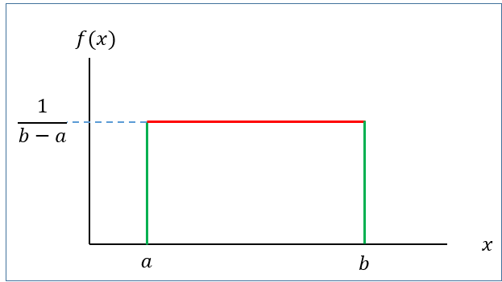
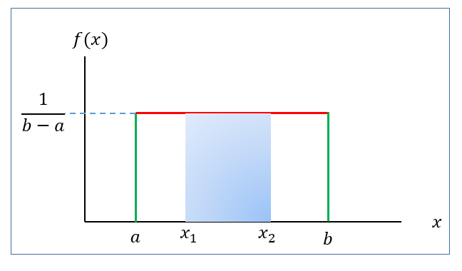
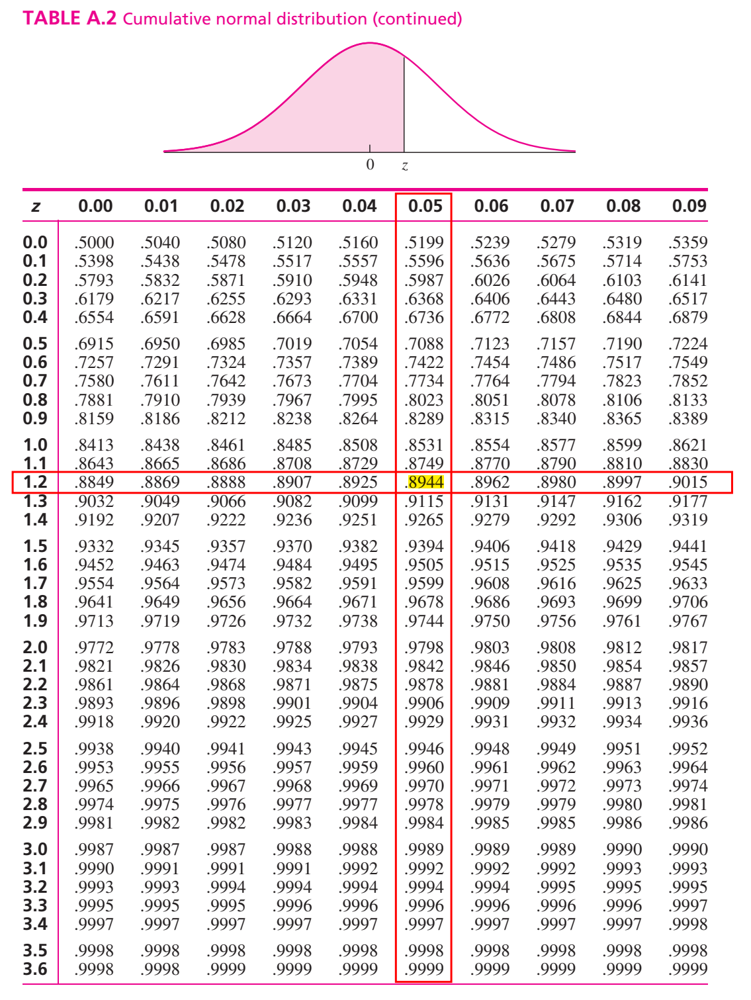
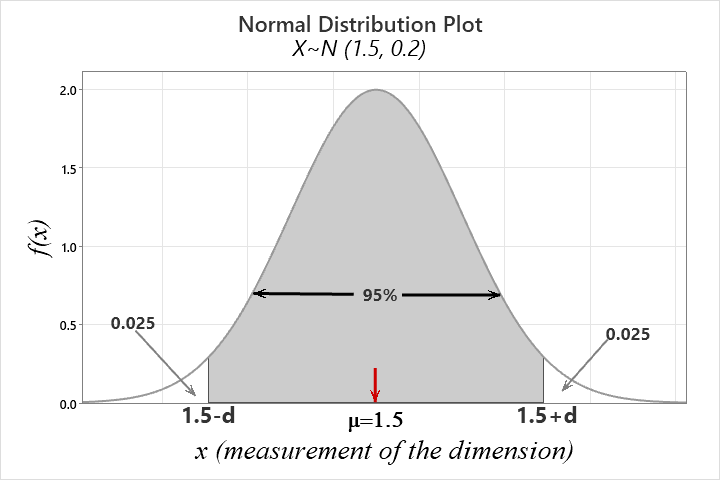

# Continuous r.v and probability density function

## **Definition**

A continuous r.v $X$ must have a probability density function (PDF) $f(x)$ such that

1\) $f(x) \ge 0$ **\[Non-negativity\]**

2\) $\int_{x\in \mathbb{R}} f(x)dx =1$ **\[Total AREA under the curve** $f(x)$ always 1\]

3\) $P(a<X<b)=\int_a^b f(x) dx$

## Illustration with an example

Given $f(x)=\frac{1}{2}x \ \ ; 0\le x\le 2$

a\) Show/plot the graph of $f(x)$.

b\) Is $f(x)$ a PDF?

c\) Find $P(X<1.0)$.

d\) Find $P(X=1.0)$

***Solution:***

\(a\)

```{r fig.width=4, fig.height=2,fig.align='center'}
par(mar = c(1.8, 2, 1, 1))

curve(0.5*x,ylab = "f(x)",lwd=1.5,col="blue",xlim=c(0,2),main="Graph of  f(x)=0.5x", cex.axis=0.7,cex.lab=1.0,cex.main=0.7)
```

b\) Here, $f(x)\ge 0$ for all values of $x$ in the interval $0\le x\le2$.

Now, **total area under curve** $f(x)$ from $x=0$ to $x=2$ is

$\int_{0}^2 f(x)dx$

$=AREA \ \ of\ \  the\ \  SHADED\ \  Triangle$

```{r fig.width=4, fig.height=2,fig.align='center'}
par(mar = c(1.8, 2, 1, 1))
# Create a plot
plot(1, type = "n", xlab = "x", ylab = "f(x)",main="", 
     xlim = c(0, 2), ylim = c(0, 1), 
     cex.axis=1.0,cex.lab=1.0,cex.main=1)

# Define the vertices of the triangle
x <- c(0, 2, 2)
y <- c(0, 0, 1)

# Draw the triangle
polygon(x, y,  border = "blue")
polygon(x,y,col="lightblue")
text(1.5, 0.3, labels = "P(0<X<2)=1", pos = 3, col = "black")

```

$$=\frac{1}{2} \times base\times height$$

$$=\frac{1}{2} \times 2\times 1=1$$

So, total area under curve $f(x)$ is $1$ that is $\int_{0}^{2} f(x)dx=1$.

Hence, $f(x)$ is a PDF.

c\) Here,

$$P(X<1)=Area \ \ under\ \ the \ \ curve \ \ from \ \ x=0 \ \ to  \ \ x=1$$

$$=Area \ \ of \ \ the \ \ SHADED \ \ Triangle$$

```{r fig.width=4, fig.height=2,fig.align='center'}
par(mar = c(1.8, 2, 1, 1))
# Create a plot
plot(1, type = "n", xlab = "x", ylab = "f(x)",main="", 
     xlim = c(0, 2), ylim = c(0, 1), 
     cex.axis=0.8,cex.lab=0.8,cex.main=0.9)

# Define the vertices of the triangle
x <- c(0, 2, 2)
y <- c(0, 0, 1)

# Draw the triangle
polygon(x, y,  border = "blue")
polygon(c(0,1,1),c(0,0,.5),col="lightblue")
# Add labels to the vertices
text(0.73, 0.1, labels = "P(X<1)=0.25", pos = 3, col = "black",cex=.8)


```

$$=\frac{1}{2}\times 1 \times f(1)=\frac{1}{2}\times 1 \times 0.5=0.25$$

Therefore $P(X<1)=0.25$

d\) $P(X=1.0)=0$ \[Because there is no area at $x=1.0$\]

::: callout-note
We always remember that **Probability in an interval of** $X$ is a**ctually the** $AREA$ **under the pdf** $f(x)$**.**
:::

**Problem 6.2.1** A random variable has the following density function.

$$f(x)=1-0.5x \ \ ; \ \ 0<x<2$$
\
a) Graph the density function.

b\) Verify that $f(x)$ is a density function.

c\) Fond $P(X>1)$.

d\) Find $P(X<0.5)$.

e\) Find $P(X=1.5)$.

**N.B:** $P(X=a)=0$ as well as $P(X=b)=0$. So, $P(X\le a )$ is same as $P(X<a)$.

## **CDF of** continuous r.v $X$

By definition, CDF,

$$F(x)=P(X\le x)= \int_{-\infty}^{x} f(x)dx$$

Therefore,

- $f(x)=\frac{d}{dx} F(x)$.

- $P(a<X<b)=F(b)-F(a)$.

## **Expectation and variance of continuous r.v**

If $X$ is a continuous r.v with PDF $f(x)$ then

Expected value of $X$ is

$$\mu=E(X)= \int_{x\in \mathbb{R}} x\cdot f(x)dx$$
Variance of $X$ is

$$Var(X)=E(X^2)-\mu^2=\int_{x\in \mathbb{R}} x^2\cdot f(x)dx-\mu^2$$

**Example 3.11**[@walpole2017] Suppose that the error in the reaction temperature, in $^0C$, for a controlled laboratory experiment is a continuous random variable X having the probability density function

$$f(x)=\frac{x^2}{3}; -1<x<2.$$

(a) Verify that $f(x)$ is a density function.
(b) Find $P(0< X \le 1)$.

**Example 3.12**[@walpole2017] Find $F(x)$, and use it to evaluate $P(0 < X\le1)$.

**H.W:** Find $E(X)$ and $Var(X)$ where,$f(x)=\frac{x^2}{3}; -1<x<2$.

**Exercise 3.29**[@walpole2017] An important factor in solid missile fuel is the particle size distribution. Significant problems occur if the particle sizes are too large. From production data in the past, it has been determined that the particle size (in micrometers) distribution is characterized by

$$f(x)=3x^{-4}; x> 1$$

(a) Verify that this is a valid density function.
(b) Evaluate $F(x)$.
(c) What is the probability that a random particle from the manufactured fuel exceeds 4 micrometers?

**Exercise 3.69**[@walpole2017] The life span in hours of an electrical component is a random variable with cumulative distribution function

$$F(x)=1-e^{-\frac{x}{50}}; x>0$$

(a) Determine its probability density function (PDF).

(b) Determine the probability that the life span of such a component will exceed 70 hours.

**Exercise 3.36** [@walpole2017] On a laboratory assignment, if the equipment is working, the density function of the observed outcome, $X$, is

$$f(x)=2(1-x) \ \ ; 0<x<1$$

a.  Calculate $P(X\le 1)$

b.  What is the probability that $X$ will exceed 0.5?

c.  Given that $X \ge 0.5$, what is the probability that $X$ will be less than 0.75?

**Hints:** We can solve this exercise by either using $F(x)$ or simply drawing function $f(x)$.

## Uniform distribution/r.v

A continuous r.v $X$ is said to be uniform r.v ranges between $a$ to $b$ if it has the following PDF

$$f(x)=\frac{1}{b-a} \ \ ; \ \ a<x<b$$
 {#eq-unif.pdf}

{#fig-unifpdf width="377"}

with

**Mean:** $\mu=E(X)=\frac{a+b}{2}$

**Variance:** $\sigma^2=\frac{(b-a)^2}{12}$

[**We write,**]{.underline} $X\sim U(a,b)$

### Finding probability for uniform r.v

If $X\sim U(a,b)$ then the $P(x_1<X<x_2)$ is actually the **area of the shaded rectangle.**

{width="380"}

That is,

$$P(x_1<X<x_2)=Base\times Height=(x_2-x_1)\times \frac{1}{b-a}$$

**Problem 1** The phase angle, $\Theta$, of the signal at the input to a modem is uniformly distributed between $0$ and $2\pi$ radians.

a\) What are the PDF, expected value, and variance of $\Theta$?

b\) Find the probability that phase angle exceeds $\frac{3\pi}{2}$?

**Problem 2** In a radio communications system, the phase difference $X$ between the transmitter and receiver is modeled as having a uniform density in $[—\pi, +\pi]$. Find $P(X < 0)$ and $P(X< \pi/2)$.\

**Problem** **3**[@navidi2011, page 278] Resistors are labeled 100 $\Omega$. In fact, the actual resistances are uniformly distributed on the interval $(95, 103)$.

a\. Find the mean resistance.

b\. Find the standard deviation of the resistances.

c\. Find the probability that the resistance is between $98$ and $102 \ \ \Omega$.

d\. Suppose that resistances of different resistors are independent. What is the probability that three out of six resistors have resistances greater than $100$ $\Omega$?

### Generating Uniform random number in R

```{r echo=TRUE, fig.height=3, fig.width=4}
#| label: fig-unifhist
#| fig-cap: "Histogram of Uniform random numbers from U(10,30), $\\ n=1000$"
#| fig-align: left

par(mar=c(4,4,1,1)) # Adjust graph margin
set.seed(911) 
u=runif(1000,10,30) # Generating 1000 random numbers from U(10,30)
hist(u,main = " ",col="steelblue",ylim = c(0,120)) # Frequency histogram of U

```

## Normal or Gaussian r.v

The most important probability distribution for describing a continuous random variable is the **normal probability distribution**. The normal distribution has been used in a wide variety of practical applications in which the random variables are heights and weights of people, test scores, scientific measurements, amounts of rainfall, and other similar values.

### Definition

A continuous r.v $X$ is said to be normal r.v if it has the following **PDF:**

$$f(x)=\frac{1}{\sigma \sqrt{2\pi}} e^{-\frac{1}{2} (\frac{x-\mu}{\sigma})^2}\ \ ; -\infty<x<\infty$$
 {#eq-normal}

The graph of $f(x)$ is called **normal curve** (@fig-normalpdf)**.**

```{r fig.height=2.5, fig.width=5}
#| label: fig-normalpdf
#| fig-cap: "Normal Curve"
#| fig-align: left

library(tidyverse)

# Create a sequence of x values
x <- seq(10, 30, length = 100)

# Calculate the y values for the normal distribution
y <- dnorm(x,20,3)

# Create a data frame
data <- data.frame(x, y)


ggplot(data, aes(x = x, y = y)) +
  geom_line(color = "blue",lwd=1) +
  labs(title = " ", 
  x=expression(mu), y = "f(x)")+
  geom_vline(xintercept=20)+
  theme_classic()+
  theme(axis.text=element_blank(),
        axis.title = element_text(size = 14),
        plot.title = element_text(hjust = 0.5)
        )->normal.curve
normal.curve  
```

**Mean:** $E(X)=\mu$

**Variance:** $Var(X)=\sigma^2$

[**We write:**]{.underline} $X\sim N(\mu , \sigma^2)$

**Properties of normal distribution**

- The **total area** under the normal curve $f(x)$ is 1 that is

  $$\int_{-\infty}^{\infty} f(x)dx=1$$

- Normal distribution is symmetric about mean, $\mu$

- Mean, median and mode is identical in normal distribution that is $Mean=Median=Mode=\mu$

- Almost $99\%$ observations of $X$ lie within **3 standard deviation of mean** that is

  $$P(\mu-3\sigma<X<\mu+3\sigma)\approx 0.99$$

- Almost $95\%$ observations of $X$ lie within **2 standard deviation of mean** that is
  $$P(\mu-2\sigma<X<\mu+2\sigma)\approx 0.95$$

- Almost $68\%$ observations of $X$ lie within **1 standard deviation of mean** that is
  $$P(\mu-\sigma<X<\mu+\sigma)\approx 0.68$$

### Standard normal r.v

Suppose $X\sim N(\mu, \sigma^2)$. Then the variable $Z=\frac{X-\mu}{\sigma}$ is said to be **standard normal variable** with **PDF**

$$f(z)=\frac{1}{\sqrt {2\pi}} e^{-z^2} \ \ ; -\infty<z<\infty$$
 {#eq-standardnorm}

**Mean:** $E(Z)=0$

**Variance:** $Var(Z)=1$

[**We write:**]{.underline} $Z\sim N(0,1)$

```{r fig.height=2.5, fig.width=5}
#| label: fig-zcurve
#| fig-align: left
#| fig-cap: "Standard normal curve"

par(mar = c(3.77, 3.77, 1, 1))

fz=function(x) {(1/sqrt(2*pi))*exp(-x^2)}

curve(fz,from = -3.2, to = 3.2,
      xlab = "z",ylab = "f(z)",lwd=2)

abline(v = 0, col = "red", lwd = 2)


```

### Computing probability(area) under standard normal curve

To compute area (probability) under the standard normal curve for a given interval of $z$ we use **standard Normal Distribution** **table** which provides cumulative probabilities.

**RULE-I:** Suppose we want to find $P(Z<1.25)$.

From **TABLE A.2** in @navidi2011 we have

$$P(Z<1.25)=0.8944$$

\
The probability $P(Z<1.25)$ is shown in @fig-areaz.

```{r fig.height=2.5, fig.width=5}
#| label: fig-areaz
#| fig-cap: "Area under standard normal curve for Z<1.25"
#| fig-align: left

# Load ggplot2 package
library(ggplot2)

# Define the mean and standard deviation
mean <- 0
sd <- 1

# Define the shading bounds for the central 95% interval
lower <- -1.96  # Lower bound (e.g., -1.96 for 95% CI)
upper <- 1.96   # Upper bound (e.g., 1.96 for 95% CI)

# Create a data frame to specify the x range
x_range <- data.frame(x = c(-4, 4))

# Create the plot
ggplot(x_range, aes(x)) +
  scale_x_continuous(breaks = seq(-4,4,1)) +
  # Plot the normal distribution curve
  stat_function(fun = dnorm, args = list(mean = mean, sd = sd)) +
  
  # Shade the area under the curve between the lower and upper bounds
  stat_function(fun = dnorm, args = list(mean = mean, sd = sd), geom = "area", 
                xlim = c(-4, 1.25), fill = "skyblue", alpha = 0.5) +
  
  # Labels and theme
  labs(x = "z", y = "f(z)", title = "") +
  theme_classic()+
  annotate("text",x=0,y=0.15,label="P(Z<1.25)=0.8944")

```

**RULE-II:** Now we find $P(Z>1.36)$

So, due to symmetry we can write $P(Z>1.36)=P(Z<-1.36)=0.0869$\

```{r fig.height=2.5, fig.width=5}
#| label: fig-areaz2
#| fig-cap: "Area under standard normal curve for Z>1.36"
#| fig-align: left

# Create the plot
ggplot(x_range, aes(x)) +
  scale_x_continuous(breaks = seq(-4,4,1)) +
  # Plot the normal distribution curve
  stat_function(fun = dnorm, args = list(mean = 0, sd = 1)) +
  
  # Shade the area under the curve between the lower and upper bounds
  stat_function(fun = dnorm, args = list(mean = mean, sd = sd), geom = "area", xlim = c(1.36, 4), fill = "skyblue", alpha = 0.5) +
  
  # Labels and theme
  labs(x = "z", y = "f(z)", title = "") +
  theme_classic()+
  annotate("text",x=3,y=0.1,label="P(Z>1.36)=0.0869")
```

**RULE-III:** Let us evaluate $P(-1.96<Z<2.58)$.

We can write

$$=P(-1.96<Z<2.58)$$

$$=P(Z<2.58)-P(Z<-1.96)$$

$$=0.9951-0.0250=0.9701$$

```{r fig.height=2.5, fig.width=5}
#| label: fig-areaz3
#| fig-cap: "Area under standard normal curve for -1.96<Z<2.58"
#| fig-align: left

# Create the plot
ggplot(x_range, aes(x)) +
  scale_x_continuous(breaks = seq(-4,4,1)) +
  # Plot the normal distribution curve
  stat_function(fun = dnorm, args = list(mean = 0, sd = 1)) +
  
  # Shade the area under the curve between the lower and upper bounds
  stat_function(fun = dnorm, args = list(mean = mean, sd = sd), geom = "area", xlim = c(-1.96, 2.58), fill = "skyblue", alpha = 0.5) +
  
  # Labels and theme
  labs(x = "z", y = "f(z)", title = "") +
  theme_classic()+
  annotate("text",x=-.02,y=.1,label="P(-1.96<Z<2.58)=0.9701")
```

### Finding quantiles (percentiles, quartiles, deciles etc.) of $Z$

What is the $90^{th}$ percentile of $Z$? To answer this question, let $k$ is the $90^{th}$ percentile of $Z$. So we can write

$$P(Z<k)=0.90 \ \  \ \ \ \ \ \ \ \cdot \cdot \cdot (1)$$

From **TABLE A.2** in @navidi2011 we have

$$P(Z<1.28)=0.90 \ \  \ \ \ \ \ \ \ \cdot \cdot \cdot(2)$$

Comparing eq.(1) with eq.(2) we have $k=1.28$. So the $90^{th}$ percentile of $Z$ is $1.28$.

**Problem 1** Find $c$ such that $P(Z>c)=0.05$.

**Problem 2** Find $c$ such that $P(-c<Z<c)=0.95$.

### Computing probability(area) under normal curve:

Suppose $X\sim N(30, 5^2)$ . Then find the following:

a\) $P(X<22)$

b\) $P(X>44)$

c\) $P(20<X<35)$

d\) If $P(X<x)=0.25$ then find the value of $x$.

***Solution:***

Here, $\mu=30$ and $\sigma=5$

------------------------------------------------------------------------

a\) $P(X<22)=P(\frac{X-\mu}{\sigma}<\frac{22-30}{5})=P(Z<-1.60)=0.0548$.

------------------------------------------------------------------------

b\) $P(X>44)=P(\frac{X-\mu}{\sigma}>\frac{44-30}{5})$

$=P(Z>2.80)=P(Z<-2.80)=0.0026$

------------------------------------------------------------------------

c\) $P(20<X<35)=P(\frac{20-30}{5}<\frac{X-\mu}{\sigma}<\frac{35-30}{5})$

$=P(-2<Z<1)=P(Z<1)-P(Z<-2)$

$=0.8413-0.0228=0.8185$

------------------------------------------------------------------------

d\) To find the value of $x$ we proceed this way.

$$P(X<x)=0.25$$

$$\implies P(\frac{X-\mu}{\sigma}<\frac{x-30}{5})=0.25$$

$$\implies P(Z<\frac{x-30}{5})=0.25 \ \ \ \ \ \cdot \cdot \cdot (1)$$

From TABLE (Appendix B) we have

$$P(Z<-0.67)=0.25  \ \ \ \ \cdot \cdot \cdot (2)$$

Comparing (1) with (2) we can write

$$\frac{x-30}{5}=-0.67$$

$$\implies x=30+(-0.67)\times 5$$

$$\therefore x=26.65$$

::: callout-note
If $P(X<x)=p$ and

$P(Z<z)=p$ then

$$x=\mu+z\sigma$$
:::

### Applications of the Normal Distribution [@walpole2017]

**Example 6.7**: A certain type of storage battery lasts, on average, 3.0 years with a standard deviation of 0.5 year. Assuming that battery life is normally distributed, find the probability that a given battery will last less than 2.3 years.

**Example 6.8** : An electrical firm manufactures light bulbs that have a life, before burn-out, that is normally distributed with mean equal to 800 hours and a standard deviation of 40 hours. Find the probability that a bulb burns between 778 and 834 hours.

**Example 6.9** : In an industrial process, the diameter of a ball bearing is an important measurement. The buyer sets specifications for the diameter to be $3.0 \pm 0.01$ cm. The implication is that no part falling outside these specifications will be accepted. It is known that in the process the diameter of a ball bearing has a normal distribution with mean $\mu = 3.0$ and standard deviation $\sigma = 0.005$. On average, how many manufactured ball bearings will be scrapped?

**Example 6.10** : Gauges are used to reject all components for which a certain dimension is not within the specification $1.50 \pm d$. It is known that this measurement is normally distributed with a mean of 1.50 and a standard deviation of 0.2. Determine the value d such that the specifications "cover" 95% of the measurements.

**Solution:**

Let, $X=measurement \ \ of \ \ certain \ \ dimension$

Given, $X\sim N(1.5,0.2)$

According to question,

$P(1.5-d<X<1.5+d)=0.95$

So, $P(X<1.5-d)+P(X>1.5+d)=0.05$

{width="404" height="239"}

So, $P(X <1.5-d)=0.025  \ \ \ \ \cdot \cdot \cdot(1)$

$\implies P(\frac{X-\mu}{\sigma} <\frac{1.5-d-1.5}{0.2})=0.025$

$\implies P(Z<\frac{-d}{0.2})=0.025 \ \ \ \ \cdot \cdot \cdot(1)$

From TABLE A.2 we have

$P(Z<-1.96)=0.025 \ \ \ \ \ \cdot \cdot\cdot(2)$

Comparing eq.(1) with eq. (2) we have

$\frac{-d}{0.2}=-1.96$

$\implies -d=-0.392$

$\therefore d=0.392$

**Alternative:**

$P(X <1.5-d)=0.025  \ \ \ \ \cdot \cdot \cdot(1)$

But, $P(Z<-1.96)=0.025 \ \ \ \ \cdot \cdot \cdot (2)$

Hence, $1.5-d=\mu+z\sigma$; where $z=-1.96$

$\implies 1.5-d=1.5-1.96\times 0.2$

$\therefore d=0.392$

**Exercise 6.11** : A soft-drink machine is regulated so that it discharges an average of 200 milliliters per cup. If the amount of drink is normally distributed with a standard deviation equal to 15 milliliters,

(a) what fraction of the cups will contain more than 224 milliliters?
(b) what is the probability that a cup contains between 191 and 209 milliliters?
(c) how many cups will probably overflow if 230-milliliter cups are used for the next 1000 drinks?
(d) below what value do we get the smallest 25% of the drinks?

**Exercise 6.14** The finished inside diameter of a piston ring is normally distributed with a mean of 10 centimeters and a standard deviation of 0.03 centimeter.

(a) What proportion of rings will have inside diameters exceeding 10.075 centimeters?
(b) What is the probability that a piston ring will have an inside diameter between 9.97 and 10.03 centimeters?
(c) Below what value of inside diameter will 15% of the piston rings fall?

**Exercise 6.17** : The average life of a certain type of small motor is 10 years with a standard deviation of 2 years. The manufacturer replaces free all motors that fail while under guarantee. If she is willing to replace only 3% of the motors that fail, how long a guarantee should be offered? Assume that the lifetime of a motor follows a normal distribution.

### Normal approximation to Binomial distribution

Binom tends to normal when $n \rightarrow \infty$ and $p\rightarrow 0.5$

```{r fig.height=3, fig.width=7}
#| label: fig-bintonorm1
#| fig-cap: "Histogram of $Bin(x; n=6,p=0.2)$"
#| fig-align: left

n1=6
p=0.2
binx1=0:n1
binfx1=dbinom(binx1,n1,p)
barplot(binfx1,lwd=1,
        space = 0, names.arg = binx1,col = "steelblue",
        #main ="Histogram for Bin(x; n=6,p=0.2)",
        xlab = "x (number of success)",
        ylab = "Probability, f(x)",
        ylim = c(0,0.40)
        )
box("outer", col = "black", lwd = 0.5)  
```

```{r fig.height=3, fig.width=7}
#| label: fig-bintonorm2
#| fig-cap: "Histogram of $Bin(x; n=15,p=0.2)$"
#| fig-align: left

n2=15
p=0.2
binx2=0:n2
binfx2=dbinom(binx2,n2,p)
barplot(binfx2,lwd=1,
        space = 0, names.arg = binx2,col = "steelblue",
        #main ="Histogram for Bin(x; n=15,p=0.2)",
        xlab = "x (number of success)",
        ylab = "Probability, f(x)",
        ylim = c(0,0.26)
        )
box("outer", col = "black", lwd = 0.5)

```

```{r fig.height=3, fig.width=7}
#| label: fig-bintonorm3
#| fig-cap: "Histogram of $Bin(x; n=50,p=0.2)$"
#| fig-align: left

n3=50
p=0.2
binx3=0:n3
binfx3=dbinom(binx3,n3,p)
barplot(binfx3,lwd=1,
        space = 0, names.arg = binx3,col = "steelblue",
        #main ="Histogram for Bin(x; n=50,p=0.2)",
        xlab = "x (number of success)",
        ylab = "Probability, f(x)",
        ylim = c(0,0.14))

box("outer", col = "black", lwd = 0.5)
```

From @fig-bintonorm1, @fig-bintonorm2 and @fig-bintonorm3 we observe that as $n$ getting large with $p=0.2$ (which is not extremely close to 0) the binomial distribution can be approximated to normal distribution.

So, when $n$ become large and $p$ is not extremely small (close to 0) or extremely large (close to 1) the normal approximation is most useful in calculating binomial sums.

::: callout-important
### Normal Approximation to the Binomial Distribution

- Let X be a binomial random variable with parameters $n$ and $p$. For large $n$, $X$ has approximately a normal distribution with $\mu = np$ and $\sigma^2 =np(1-p)$.

- The approximation will be good if $np$ and $n(1-p)$ are greater than or equal to $5$ [@walpole2017].
:::

**Continuity correction**

This correction is needed when we approximate a discrete distribution (Binomial in this case) by a continuous distribution (Normal). Recall that the probability $P(X = x)$ may be positive if $X$ is discrete, whereas it is always $0$ for continuous $X$. This is resolved by introducing a continuity correction. Expand the interval by 0.5 units in each direction, then use the Normal approximation [@baron2019].

| Binomial Probability | With continuity correction |
|:--------------------:|:--------------------------:|
|       $P(X=x)$       |     $P(x-0.5<X<x+0.5)$     |
|     $P(X\le x)$      |      $P(X\le x+0.5)$       |

: Continuity correction for binomial probabilities

**Example 6.15** [@walpole2017, page 191]: The probability that a patient recovers from a rare blood disease is 0.4. If 100 people are known to have contracted this disease, what is the probability that fewer than 30 survive?

## Exponential r.v

In many situations, such as when modeling waiting times, inter-arrival times, the lifespan of hardware, breakdown times, and the intervals between phone calls, the exponential distribution is utilized. The time (suppose $T$) between rare events in Poisson process with arrival rate $\lambda$ (*number of arrival per unit time*) can be treated as exponential r.v.

The exponential r.v $T$ has the following PDF

$$f(t)=\lambda e^{-\lambda t} \ \ ; \ \ t>0$$
 {#eq-expo}

- **CDF:** $F(t)=P(T\le t)=P(T< t)=1-e^{-\lambda t}; t> 0$

  Hence, $P(T> t)=1-P(T\le t)=1-F(t)=e^{-\lambda t}$

- **Mean:** $E(T)=\frac{1}{\lambda}$

- **Variance:** $Var(T)=\frac{1}{\lambda^2}$

- [**We write**]{.underline}**,** $T\sim Exp(\lambda)$

```{r fig.height=3.5,fig.width=6}
#| label: fig-expo
#| fig-cap: "Exponential probability density functions for selected values of $\\lambda$"

library(tidyverse)

t <- seq(0,5,0.1)

#plot(t,dexp(t,0.5),type = "l")

exp1<-dexp(t,0.5)
exp2<-dexp(t,1 )
exp3<-dexp(t,1.5)

wide.exp<-data.frame(t,exp1,exp2,exp3)
#wide.ps

long.exp<-wide.exp%>%gather(key = "rate",value = "density",-t)
#head(long.ps)

long.exp$rate<-factor(long.exp$rate,labels = c("0.5","1","1.5"))
#head(long.exp)

long.exp%>%ggplot(aes(t,density,color=rate))+
   geom_line(lwd=0.7)+
   #facet_wrap(~rate,labeller = label_parsed)+
   scale_x_continuous(breaks = seq(0, 5, 1.5),limits=c(0, 5))+
   labs(x="t (Time) ",y="f(t)",
        #title =expression(paste("Exponential probability density functions for selected values of"," ",lambda )),
        color=expression(paste(lambda,"(Arrival rate)")))+
   theme_bw()+
  theme(legend.position = "right",
        plot.title = element_text(size = 14),
        plot.background = element_rect(color = "black"))

```

The quantity $\lambda$ is a parameter of Exponential distribution, and its meaning is clear from $E(T) = \frac{1}{\lambda}$ . If T is time, measured in minutes, then $\lambda$ is a frequency, measured in $min^{-1}$. For example, if arrivals occur every half a minute, on the average, then $E(T) = 0.5$min and $\lambda=2$, saying that they occur with a frequency (arrival rate) of 2 arrivals per minute. This $\lambda$ has the same meaning as the parameter of Poisson distribution[@baron2019].

**Example 4.5**[@baron2019] Jobs are sent to a printer at an average rate of 3 jobs per hour.

(a) What is the expected time between jobs?

(b) What is the probability that the next job is sent within 5 minutes?

**Solution:** Given, number of jobs per hour, $\lambda=3\ \ hr^{-1}$ per hour. Let, $T$=time elapsed between jobs (hour).

So, $T\sim Exp(\lambda)$

(a) $E(T)=\frac{1}{\lambda} hr=\frac{1}{3} hr=20\ \ mins$;

(b) Here, $5 \ \ mins=\frac{5}{60} hr=\frac{1}{12} hr$ We know, $F(t)=1-e^{-\lambda t}; t>0$

So, $P(T<5 \ \ mins)=P(T<\frac{1}{12})=F(\frac{1}{12})=1-e^{-3*\frac{1}{12}}=0.22$

**Example 4.58** [@navidi2011] A radioactive mass emits particles according to a Poisson process at a mean rate of 15 particles per minute. At some point, a clock is started. What is the probability that more than 5 seconds will elapse before the next emission? What is the mean waiting time until the next particle is emitted?

**Solution**

Let, $T=elapsed \ \ time \ \ before \ \ the \ \ next \ \ emission (in \ \ second)$

Given, $\lambda=15 min^{-1}=\frac{15}{60} s^{-1}=0.25 s^{-1}$ and

$T\sim Exp(\lambda)$;

$P(T\le t)=F(t)=1-e^{-\lambda t}$

*P(more than 5 seconds will elapse before the next emission)*=$P(T>5)=e^{-\lambda * 5}=e^{-0.25*5}=0.2865$

*Mean waiting time*, $E(T)=\frac{1}{\lambda} s=\frac{1}{0.25}s=4s$

### Lack of Memory Property

If $T \sim Exp(\lambda)$, and $t$ and $s$ are positive numbers, then

$$P(T> t+s| T> s)=P(T> t)$$

We can also express the *Lack of memory property* in this way:

$$P(T< t+s| T> s)=P(T< t)$$

The probability that we must wait additional $t$ units, given that we have already waited $s$ units, is the same as the probability that we must wait $t$ units from the start. The exponential distribution does not "*remember*" how long we have been waiting.

- In particular, if the lifetime of a component follows the exponential distribution, then the probability that a component that is $s$ time units old will last an additional $t$ time units is the same as the probability that a new component will last $t$ time units.

- In other words, a component whose lifetime follows an exponential distribution does not show any effects of age or wear[@navidi2011].

- But if the failure of the component is a result of gradual or slow wear (as in mechanical wear), then the exponential does not apply and either the **gamma** or the **Weibull distribution** (see [@walpole2017], Section 6.10) may be more appropriate.

**Example 4.59**[@navidi2011] The lifetime of a particular integrated circuit has an exponential distribution with mean 2 years. Find the probability that the circuit lasts longer than three years.

**Example 4.60**[@navidi2011] Refer to Example 4.59. Assume the circuit is now four years old and is still functioning. Find the probability that it functions for more than three additional years (Hints: Apply Lack of Memory Property).

**Exercises for Section 4.7**[@navidi2011]

1.Let $T \sim Exp(0.45)$. Find $\mu_T, \sigma^2_T, P(T>3)$ and the median of $T$.

2.The time between requests to a web server is exponentially distributed with mean 0.5 seconds.

a.  What is the value of the parameter $\lambda$?
b.  What is the median time between requests?
c.  What is the standard deviation?
d.  What is the 80th percentile?
e.  Find the probability that more than one second elapses between requests.
f.  If there have been no requests for the past two seconds, what is the probability that there more than one additional second will elapse before the next request?

***Solution***

Let, $T=time \ \ between \ \ requests \ \ in \ \ second$

If, $T\sim Exp(\lambda)$; then it is given that

$E(T)=0.5 \ \ second$

$\implies \frac{1}{\lambda}=0.5 \ \ second$

**a.** $\therefore \lambda=2 s^{-1}$

**b.** If $M$ is the median time between request then,

$P(T \le M)=0.5$

$\implies F(M)=0.5$

$\implies 1-e^{-\lambda *M}=0.5$

$\implies e^{-\lambda *M}=0.5$

$\implies {-\lambda *M}=ln(0.5)$

$\implies M =\frac{ln(0.5)}{-\lambda}=\frac{ln(0.5)}{-2}=0.3466\approx0.35$

So, median time between request is $0.35s$

**c.** Standard deviation of $T$, $\sigma_T=\frac{1}{\lambda}s=1/2 =0.5 s$

**d.** Let, $P_{80}$ denotes 80th percentile.

So, solve the following equation for $P_{80}$

$P(T\le P_{80})=0.80$

$\implies P(T>P_{80})=0.20$

$\implies e^{-\lambda \times P_{80}}=0.20$

$\implies P_{80}=\frac {ln(0.20)}{-\lambda}=0.805$

$\therefore P_{80}=0.805 s$

**e.** $P(T>1)=e^{-\lambda *1}=0.1353$

**f.** If there have been no requests for the past two seconds, the probability that there more than ***one*** **additional second** will elapse before the next request is:

$P(T>1+2 /T>2)=P(T>1)=e^{-\lambda *1}=0.1353$ \[by using *Lack of memory property*\]

8.A radioactive mass emits particles according to a Poisson process at a mean rate of 2 per second. Let T be the waiting time, in seconds, between emissions.

a.  What is the mean waiting time?
b.  What is the median waiting time?
c.  Find $P(T > 2)$. Hint:$P(T > 2)=e^{-\lambda *2}$
d.  Find $P(T < 0.1)$.Hint:$P(T < 0.1)=F(0.1)$
e.  Find $P(0.3< T < 1.5)$. Hint:$P(0.3< T < 1.5)=F(1.5)-F(0.3)$
f.  If 3 seconds have elapsed with no emission, what is the probability that there will be an emission within the next second? (Use Lack of Memory Property)

**Solution of f.**

Since T is exponentially distributed and hold lack of memory property, so it dose not matter what was happened in past 3 seconds. We have to just compute that *there will be an emission (event will occur) within the next second*. So,

$P(T<1)=F(1)=1-e^{-\lambda*1}$ (*do yourself*)

### Generating exponential random numbers in R

```{r echo=TRUE}
#| label: fig-rexpo
#| fig-cap: "Histogram of exponential random variable from Exp($\\lambda=2.5)$,$\\ n=1000$"
#| fig-align: left

par(mar=c(4,4,1,1)) # Adjust graph margin
set.seed(911) 
t=rexp(1000,rate = 2.5)
hist(t, main = "",col = "steelblue")
```
