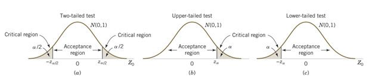

# Statistical inference

**Statistical inference** refers to the branch of statistics that focuses on making decisions and drawing conclusions about populations based on sample data. These methods use information collected from a sample to infer characteristics of the larger population.

Statistical inference may be divided into two major areas:

- **Parameter estimation** and

- **Hypothesis testing**

**Parameter estimation** involves estimation of population **parameter** from **sample data**.

**Hypothesis testing** involves test any **claim** about **population parameter** using sample data.

## Parameter estimation

### Point estimation

**Point Estimation** is a type of statistical inference where we use sample data to calculate a **single number** (a point) that serves as the best guess for an unknown population parameter.

::: callout-note
**Random sample**

**Statistic**

**Point estimator**

**Point estimate**
:::

+-------------------------------+----------+---------------------------------------------------------------------------------------+
| Population parameter          | Symbol   | Point estimator                                                                       |
+===============================+:========:+:=====================================================================================:+
| Population mean               | $\mu$    | Sample mean,                                                                          |
|                               |          |                                                                                       |
|                               |          | $\bar X=\frac{\sum_{i=1}^n X_i}{n}$                                                   |
+-------------------------------+----------+---------------------------------------------------------------------------------------+
| Population standard deviation | $\sigma$ | Sample standard deviation,                                                            |
|                               |          |                                                                                       |
|                               |          | $S=\sqrt{\frac{\sum(X-\bar X)^2}{n-1}}=\sqrt {\frac{\sum X^2 -n\cdot \bar X^2}{n-1}}$ |
+-------------------------------+----------+---------------------------------------------------------------------------------------+
| Population proportion         | $p$      | Sample proportion,                                                                    |
|                               |          |                                                                                       |
|                               |          | $\hat P=\frac{\# \ \ of \ \  outcomes\ \ of  \ \ interest }{n}$                       |
+-------------------------------+----------+---------------------------------------------------------------------------------------+

: Some common population parameters and their point estimators

### Properties of Point Estimators

Suppose

$\theta$ be the population parameter of interest

$\hat \theta$ be the sample statistic or point estimator of $\theta$

A "good" estimator has some desirable properties.

**Unbiasedness**

A sample statistic $\hat \theta$ is said to be unbiased estimator of the population parameter $\theta$ if

$$E(\hat\theta)=\theta$$ **Efficiency**

**Consistency**

### Sampling Distributions and the Central Limit Theorem

The probability distribution of a **sample statistic** is called a **sampling distribution.**

For example, due to sampling variability the **sample mean** $\bar X$ has a sampling distribution.

**Sampling distribution of** $\bar X$

Suppose that a random sample of size $n$ is taken from a normal population with mean $\mu$ and variance $\sigma^2$. Now each observation in this sample, say, $X_1, X_2,...,X_n$, is a normally and independently distributed random variable with mean $\mu$ and variance $\sigma^2$. Then because linear functions of independent, normally distributed random variables are also normally distributed (Chapter ?), we conclude that the sample mean

$$\bar X=\frac{X_1+X_2+....+X_n}{n}$$ has a normal distribution with mean $\mu_{\bar X}=\mu$ and variance $\sigma^2_{\bar X}=\frac{\sigma^2}{n}$.

Symbolically, $\bar X \sim N(\mu,\frac{\sigma^2}{n})$.

**But what if we sampling from a non-normal population?**

The sampling distribution of the sample mean will still be approximately normal with mean $\mu$ and variance $\frac{\sigma^2}{n}$ if the sample size $n$ is large. This is one of the most useful theorems in statistics, called the central limit theorem. The statement is as follows:

::: callout-note
## Central limit theorem

If $X_1,X_2,...,X_n$ is a random sample of size $n$ taken from a population (either finite or infinite) with mean $\mu$ and finite variance $\sigma^2$ and if $\bar X$ is the sample mean, the limiting form of the distribution of

$$Z=\frac{\bar X-\mu}{\sigma/\sqrt n}$$

as $n\rightarrow\infty$, is the standard normal distribution that is $Z\sim N(0,1)$
:::

The definition of "sufficiently large" depends on the extent of non-normality of $X$ . Some authors consider a sample will be sufficiently large if $n\ge30$ [@walpole2017].

::: callout-important
## Central Limit Theorem through simulation

In this section we illustrates how sampling distributions of sample means approximate to normal or bell shaped distribution as we increase the sample size .

**At first,** we consider a population data regarding `gdp per capita (USD),2023` of 218 countries. We can see that the distribution of `gdp per capita` is highly skewed to the right (see @fig-fig_clt1).

```{r}
#| label: fig-fig_clt1
#| fig-cap: "Frequency histogram of GDP percapita of N=218 countries"

library(readxl)

GDP_percap23 <- read_excel("StatForBandE_data.xlsx", 
    sheet = "GDP_percap23")
#View(GDP_percap23)
library(tidyverse)
library(scales)


#GDP_percap23 %>% select(`Country Name`,Y_2023) %>%arrange(-Y_2023)

GDP_percap23 %>% select(`Country Name`,Y_2023) %>%
  filter(`Country Name`!="Monaco") %>% 
  drop_na()->gdp_2023

#gdp_2023 %>% summarise(mu=mean(Y_2023), sigma=sd(Y_2023)) %>% 
#  knitr::kable(digits = 2)

gdp_2023%>%
  ggplot(aes(x=Y_2023))+
  geom_histogram(col="black",fill="lightblue",bins = 10)+
  scale_x_continuous(labels = comma)+
  labs(x="GDP per capita (USD)",y="Number of countries",
       caption="Source: World Bank, 2023")+
  theme_bw()+
  theme(plot.caption =element_text(face = "italic",size = 12))+
  annotate("text", x=100000,y=75, 
           label = expression(~mu == 19575.12),
           color = "black", size = 4)+
  annotate("text", x=100000,y=70, 
           label = expression( ~ sigma == 25324.77),
           color = "black", size = 4)+
  annotate("rect",xmin = 83000, xmax = 119500, ymin = 65, ymax = 80, 
           alpha = 0.2, fill = "lightblue")


```

**Now** we draw 1000 random samples (without replacement) of different sample sizes and then plot the histogram of samples means.

```{r}
#| label: fig-cltsim
#| fig-cap: "Demonstration of Central Limit Theorem through simulation"
#| fig-subcap: 
#|   - "Sampling distribution of sample mean for sample size n=10"
#|   - "Sampling distribution of sample mean for sample size n=30"
#|   - "Sampling distribution of sample mean for sample size n=100"
#| layout-ncol: 3


xgdp<-gdp_2023$Y_2023
nsim=1000 # no of simulations/ samples

set.seed(231)

replicate(nsim,sample(xgdp,10)) %>%colMeans() %>%as.data.frame() %>% ggplot(aes(x=.))+
  geom_histogram(bins = 10,fill="steelblue1",col="black")+
  theme_bw()->pclt_1

  

replicate(nsim,sample(xgdp,30)) %>%colMeans() %>%as.data.frame() %>% ggplot(aes(x=.))+
  geom_histogram(bins = 10,fill="steelblue2",col="black")+
  theme_bw()->pclt_2
  

replicate(nsim,sample(xgdp,100)) %>%colMeans() %>%as.data.frame() %>% ggplot(aes(x=.))+
  geom_histogram(bins = 10,fill="steelblue3",col="black")+
  theme_bw()->pclt_3

pclt_1
pclt_2
pclt_3

```

From @fig-cltsim we can see that as the sample size increases, the sampling distribution of **sample mean** tends to bell-shaped or normal though the population data was very skewed to the right. This simulation clearly demonstrate the fact of Central Limit Theorem (CLT).

For more interactive simulation of **CLT** please [click here to visit the ShinyApp for Central Limit Theorem Simulation](https://saifuddin24.shinyapps.io/CLT_Sim/).
:::

**Problem 7.1** An electronics company manufactures resistors that have a mean resistance of 100 ohms and a standard deviation of 10 ohms. The distribution of resistance is normal. **Find** the probability that a random sample of n = 25 resistors will have an average resistance of fewer than 95 ohms.

**Problem 7.2** Resistors are labeled 100 $\Omega$. In fact, the actual resistances are uniformly distributed on the interval $(95, 103)$. Suppose 40 resistors are randomly selected. **Determine** the probability that the sample mean of 40 resistors will be less than 100 $\Omega$?

[Solution:]{.underline} Let $X$ be the resistance in ohm. Given $X\sim U(95,103)$.

Hence, $\mu=E(X)=\frac{a+b}{2}=\frac{95+103}{2}=99$ and

$\sigma^2=\frac{(b-a)^2}{12}=\frac{(103-95)^2}{12}=5.33$.

Since $n=40$ is sufficiently large so according to **CLT** $\bar  X\sim_{} N(\mu, \sigma^2_{\bar X})$ approximately.

Here, $\sigma^2_{\bar X}=\sigma^2/n=5.33/40=0.13325$ and $\sigma_{\bar X}=\sqrt 0.13325=0.3650$

$$\therefore P(\bar X<100)=P\left(\frac{\bar X-\mu}{\sigma_{\bar X}}< \frac{100-99}{0.3650}\right)=P(Z<2.74)=0.9969$$ .

**Problem 7.3** A synthetic fiber used in manufacturing carpet has tensile strength that is normally distributed with mean 75.5 psi and standard deviation 3.5 psi. **Find** the probability that a random sample of n = 6 fiber specimens will have sample mean tensile strength that exceeds 75.75 psi.\

### Methods of point estimation

Two popular methods of estimations are (a) the **method of moments** and (b)the **method of** **maximum likelihood** .

#### Method of moments

Method of moments uses the relationship between population and sample moments to estimate parameters of interest.

::: callout-note
## Moments

The $k^{th}$ population moment is

$$\mu'{_k}= E(X^k) ,\ \  k=1,2,...$$

The corresponding $k^{th}$ sample moment is

$$m'_{k}=\frac{\sum_{i=1}^n X_i} {n} , \ \ k=1,2,....$$
:::

#### Moment Estimators

To estimate $k$ parameters, equate the *first* $k$ population moments to the first $k$ sample moments and solving the resulting equations for the unknown parameters.

For instance, to estimate **two parameter** we can write

$$\mu'_{1}=m'_{1}$$

and

$$\mu'_{2}=m'_{2}$$

For details see [@montgomery2014, page 256] and [@baron2019, page 245].

#### Method of maximum likelihood

The maximum likelihood technique is among the most effective ways to get a point estimator of a parameter. The renowned British statistician Sir R. A. Fisher created this method in the 1920s. As the name suggests, the value of the parameter that maximizes the **likelihood function** will serve as the estimator.

::: callout-note
## Maximum Likelihood Estimator

Suppose that $X$ is a random variable with probability distribution $f (x;\theta )$ where $\theta$ is a single unknown parameter. Let $x_1,x_2,...,x_n$ be the observed values in a random sample of size $n$. Then the likelihood function of the sample is

$$L(\theta)=f(x_1;\theta)\cdot f(x_2;\theta)....f(x_n;\theta)=\prod_{i=1}^n f(x_i;\theta)$$ The **maximum likelihood estimator (MLE)** of $\theta$ is the value of $\theta$ that maximizes the likelihood function $L(\theta)$ .
:::

For details see [@montgomery2014, page 258] and [@baron2019, page 248].

## Interval estimation

Instead of estimating a population parameter by a single value (point estimator) it is more reasonable to estimate with an **interval** with some confidence (probability) that our **parameter** value will be in the **interval.**

::: callout-note
## Interval Estimator

An **interval estimator** is a rule for determining (based on sample information) an interval that is likely to include the parameter. The general form of an interval estimate is as follows:

$$Point\ \ estimate \pm margin \ \ of \ \ error$$
:::

Due to sampling variability, **interval estimator** is also random.

::: callout-note
## Developing (1-$\alpha$)% CI for $\mu$

```{r fig.height=3}
#| label: fig-figCI
#| fig-cap: "$P(-z_{\\alpha/2}<Z<z_{\\alpha/2}) =1-\\alpha$"

# Load necessary package
library(ggplot2)

# Create data for the normal curve
x <- seq(-4, 4, length = 1000)
y <- dnorm(x)

# Set alpha level
alpha <- 0.05
z_alpha <- qnorm(1 - alpha/2)  # e.g., 1.96 for 95% confidence

# Make a data frame
df <- data.frame(x, y)

# Plot
ggplot(df, aes(x, y)) +
  geom_line(color = "blue", size = 1.2) +   # normal curve
  geom_area(data = subset(df, x >= -z_alpha & x <= z_alpha), 
            aes(x, y), fill = "skyblue", alpha = 0.5) +  # shaded middle area
  geom_vline(xintercept = c(-z_alpha, z_alpha), linetype = "dashed", color = "red") + # critical lines
  scale_x_continuous(
    breaks = c(-z_alpha, 0, z_alpha),
    labels = c(expression(-z[alpha/2]), expression(0), expression(z[alpha/2]))
  ) +
  labs(
    title = expression(paste("Standard Normal Curve with ", (1-alpha), " Confidence Interval")),
    x = "Z value",
    y = "Density"
  ) +
  theme_minimal() +
  annotate("text", x = 0, y = 0.1, 
           label = expression((1-alpha)),
           size = 5, color = "darkblue")


```
:::

### Interval estimate of a population mean: $\sigma$ known

The $(1-\alpha)100\%$ confidence interval for $\mu$ is :

$$\bar x \pm z_{\alpha/2} \frac{\sigma}{\sqrt n}$$ {#eq-9.1}

Or,

$$\bar x-z_{\alpha/2}\frac {\sigma}{\sqrt n}, \bar x+z_{\alpha/2}\frac {\sigma}{\sqrt n}$$

We can express this confidence interval in a probabilistic way:

$$P\left( \bar x-z_{\alpha/2}\frac{\sigma}{\sqrt n}<\mu<\bar x+z_{\alpha/2}\frac{\sigma}{\sqrt n}  \right)=1-\alpha$$

**NOTE:**

1\) Here, $z_{\alpha/2}$ is the $z$ value providing an area of $\alpha/2$ in the upper tail of the standard normal distribution that is $P(Z>z_{\alpha/2})=\alpha/2$.

2\) $z_{\alpha/2} \cdot \frac{\sigma}{\sqrt n}$ is often called **margin of error (ME)**.

### **Interpretation of confidence interval**

The probabilistic equation of confidence interval says that, if we repeatedly construct confidence intervals in this manner, we will expect $(1-\alpha)100\%$ of them contain $\mu$.

### Understanding confidence interval through Simulation

Suppose $X\sim N(50,5^2)$ . Now consider a population data of size $N=10000$ and the histogram of $X$ is:

```{r}
set.seed(36)
X<-rnorm(10000,50,5)

hist(X,freq = F,sub= "Population size, N=10000")
lines(density(X),lwd=2)
```

Now we draw a random sample of size $n=50$ from this population and construct a 95% confidence interval (CI) for $\mu$. The CI may or may not include the $\mu=50$ !!!

```{r}
set.seed(36)
mu=50;sigma=5

## Constructing (1-alpha)*100% CI

alpha=0.05 

con.coef=1-alpha # confidence level

z=round(abs(qnorm(alpha/2)),2)# z=1.96

n=50 # sample size

s.e<-sigma/sqrt(n)

sampl_1<-sample(X,n)
cat("Sample data :", sampl_1)

cat("Sample mean:",round(mean(sampl_1),2))

ci_1<-c(lower=mean(sampl_1)-z*s.e,upper=mean(sampl_1)+z*s.e)
#ci_1[1]
cat("95%  CI:","\n", "[Lower ,Upper]","\n", "[",round(ci_1[1],2),",",round(ci_1[2],2),"]")
```

Luckily our 95% CI contains the true population mean $\mu=50$ 😊.

Lets simulate 100 samples each of size $n=50$ and construct all 95% CIs.

```{r}
#| label: fig-conf_sim
#| fig-cap: "Simulation of 95% confidence intervals for $\\mu$"

library(tidyverse)

# Suppose, X~N(50,5^2); so
#cat("mu=",50,",", "sigma=",5)


# Let simulate 100 samples each of size n=50

sampl=0

B=100 # number of samples we have drawn from population X

sampl<-(replicate(B,sample(X,n,replace = FALSE)))

sample.means<-colMeans(sampl)

#class(sample.means)

sample.means<-as.data.frame(sample.means)
#class(sample.means)

sample.means%>%rename(x_bar=sample.means)->sample.means

ci<-sample.means%>%mutate(ll=x_bar-z*s.e,ul=x_bar+z*s.e)

ci%>%mutate(id=1:100)%>%select(id,x_bar,ll,ul)->ci

ci%>%mutate(Capture=ifelse(50>ll & 50<ul,"1","0"))->ci_95

#ci%>%head()

# https://statisticsglobe.com/draw-plot-with-confidence-intervals-in-r

colorset = c('0'='red','1'='black')


labels<- expression("Population mean,"~mu == 50)

ggplot(ci_95, aes(id, x_bar)) +
  geom_point() +
  geom_errorbar(aes(ymin = ll, ymax = ul,color = Capture))+
  geom_hline(yintercept = 50, linetype = "dashed", color = "blue")+
  scale_color_manual(values = colorset)+
  ylim(45,55)+
  scale_x_continuous(breaks = seq(1,100,5),limits=c(0, 101))+
  #annotate("text",label=paste("Population mean,mu=",mu),x=90,y=54)+
  annotate("text",x=90,y=53.5,label=as.character(labels),parse=TRUE)+
    labs(title =paste(con.coef*100, "% Confidence Intervals, n =", n),
       x="Sample ID")+
  coord_flip()+
  theme_bw()
```

We can see that out of 100 CIs , 95 of them contain true population mean $\mu=50$ and the rest 5 do not.

| $1-\alpha$ | $\alpha$ | $z_{\alpha/2}$ |
|:----------:|:--------:|:--------------:|
|    0.90    |   0.10   |     1.645      |
|    0.95    |   0.05   |      1.96      |
|    0.98    |   0.02   |      2.33      |
|    0.99    |   0.01   |     2.575      |

: Four Commonly Used Confidence Levels and $z_{\alpha/2}$

### Interval estimate of a population mean: $\sigma$ unknown

The $(1-\alpha)100\%$ confidence interval for $\mu$ is :

$$\bar x \pm t_{\alpha/2} \frac{s}{\sqrt n}$$ {#eq-9.2}

Or,

$$\bar x-t_{\alpha/2}\frac {s}{\sqrt n}, \bar x+t_{\alpha/2}\frac {s}{\sqrt n}$$

We can express this confidence interval in a probabilistic way:

$$P\left( \bar x-t_{\alpha/2}\frac{s}{\sqrt n}<\mu<\bar x+t_{\alpha/2}\frac{s}{\sqrt n}  \right)=1-\alpha$$

Here, $t_{\alpha/2}$ is the $t$ value providing an area of $\alpha/2$ in the upper tail of the $t$ distribution with $(n-1)$ degrees of freedom that is $P(T>t_{\alpha/2,n-1})=\alpha/2$.

::: callout-note
## *t*-Distribution

Let $Z\sim N(0,1)$ and $V\sim \chi^2 _\nu$ . If $Z$ and $V$ are independent then the random variable

$$T=\frac{Z}{\sqrt {V/\nu}}$$

said to have a *Student-t distribution with* $\nu$ *degrees of freedom.* The PDF of $T$ is

$$f(t)=\frac{\Gamma [(\nu+1)/2]}{\sqrt{ \pi\nu} \ \ \Gamma{(\nu/2)}}\left(1+\frac{t^2}{\nu}\right)^{-(\nu+1)/2} ; -\infty<t<\infty.$$

**Properties:**

1)  **Symmetry:** $t$-distribution is symmetric about mean (zero). So

    if $P(T>t_\nu)=\alpha$ then $P(T<-t_\nu)=\alpha$.

2)  **Convergence to Normal:** As $n\rightarrow\infty$ then the distribution of $T_\nu$ approaches the **standard normal distribution**.

3)  **Cauchy as special case:** The $T_1$ distribution is the same as the Cauchy distribution.
:::

## Hypothesis test : Introduction and testing one population parameter

### **Definition**

A statistical hypothesis is a *statement* about the *parameters* of one or more populations.

**Example 1:** A manufacturer claims that the mean life of a smartphone is more than 1.5 years.

**Example 2:** A local courier service claims that they deliver a ordered product within 30 minutes on average.

**Example 3:** A sports drink maker claims that the mean calorie content of its beverages is 72 calories per serving.

### Types of hypothesis

Statistical hypothesis are stated in two forms- (i) Null hypothesis ($H_0$) and (ii) Alternative hypothesis ($H_1$).

Both null and alternative hypothesis are the written about the parameter of interest based on the claim.

- We will always state the null hypothesis as an **equality claim**.

- However, when the alternative hypothesis is stated with the **"\< "** sign, the implicit claim in the null hypothesis can be taken as **" ≥ "** or **"="** sign.

- When the alternative hypothesis is stated with the **"\>"** sign, the implicit claim in the null hypothesis can be taken as **"≤"** or **"="** sign.

### Developing hypotheses

To develop or state null and alternative hypothesis, at first we have to clearly identify the **"claim"** about population parameter. Now we will see some examples.

**Example 1:** A manufacturer claims that the mean life of a smartphone is more than 1.5 years.

**Hypothesis:**

::: text-center
$H_0:\mu=1.5$

$\ \ \ \ \ \ \ \ \ \ \ \ \ \  H_1: \mu>1.5 \ \ (claim)$
:::

**Example 2:** A local courier service claims that they deliver a ordered product within 30 minutes on average.

**Hypothesis:**

::: text-center
$H_0: \mu=30$

$\ \ \ \ \ \ \ \ \ \ \ \ \ \ H_1: \mu<30 \ \ (claim)$
:::

**Example 3:** A sports drink maker claims that the mean calorie content of its beverages is 72 calories per serving.

**Hypothesis:**

::: text-center
$\ \ \ \ \ \ \ \ \ \ \ \ \ \ H_0: \mu=72 \ \ (claim)$

$H_1: \mu \ne 72$
:::

### Types of test based on alternative hypothesis $H_1$

- $H_1: \mu< \mu_0$ (Lower tailed)

- $H_1: \mu> \mu_0$ (Upper tailed)

- $H_1: \mu \ne \mu_0$ (Two-tailed)

### Types of error in hypothesis test

While testing a statistical hypothesis concerning population parameter we commit two types of errors.

- **Type I error** occurs when we **reject** a **TRUE** $H_0$

- **Type II error** occurs when we **FAIL to reject** a **FALSE** $H_0$

- The **Level of significance** is the probability of comiting **Type** **I error**. It is denoted by $\alpha$.

$$\alpha= P(Type \ \ I \ \ error)$$

- The probability of committing a **Type II error**, denoted by $\beta$.

$$\beta =P(Type \ \ II \ \ error)$$

::: callout-important
## Note

**Type I** **error** is more serious than **Type II** error. Because rejecting a TRUE statement is more devastating than FAIL to reject a FALSE statement. So, we always try to keep our probability of Type I error as small as possible (1% or at most 5%).
:::

**So, how these hypotheses will be tested?**

To test a hypothesis we have to determine

- a **test-statistic**; and

- **Critical/Rejection region** based on the sampling distribution of test-statistic for a given $\alpha$ ;

- If the value of test-statistic **falls** in **Critical/Rejection region**, then we reject Null ($H_0$) hypothesis; otherwise not.

Another way is to use **P-value.** What is p-value?

- The **P-value** is the smallest level of significance that would lead to rejection of the null hypothesis $H_0$ with the given data.

- The **P-value** is the probability of observing a test statistic as extreme as, or more extreme than, the value calculated from your sample data, *assuming that the null hypothesis is true*.

- **If** $P$**-value** $\le\alpha$ **, reject the null hypothesis otherwise we fail to reject** $H_0$**.**

- Most of the statistical softwares routinely compute p-value for any hypothesis test.\

### Hypothesis testing concerning population mean ($\mu$)

The following two hypotheses tests are used concerning population mean ($\mu$):

1\. One sample z-test (with known $\sigma$)

2\. One sample t-test (with unknown $\sigma$)\

#### One sample z-test

When sampling is from a **normally distributed population** or **sample size is sufficiently large** and t**he population variance is known**, the test statistic for testing $H_0: \mu=\mu_0$ at $\alpha$ is

$$z_0=\frac{\bar x-\mu_0}{\sigma /\sqrt n}$$

**Decision (Critical value approach):** If calculated $z$ falls in rejection region (CR) , then reject $H_0$ . Otherwise, do not reject $H_0$.

- For lower tailed test, reject $H_0$ if $z_0<-z_\alpha$ ;

- For upper tailed test, reject $H_0$ if $z_0> z_\alpha$ ;

- For two-tailed test, reject $H_0$ if $z_0<-z_{\alpha/2}$ or $z_0>z_{\alpha/2}$ .

{#fig-7.5 fig-alt="Source: D.C Montgomery (2014)" width="624"}

```{r}
library(reticulate)
```

**Decision (P-value approach):** If calculated P-value for the test statistic is less than or equal to $\alpha$ then reject the $H_0$ otherwise do not reject.

- For lower tailed test, $P$-value $=P(Z<z_0)$;

- For upper tailed test, $P$-value $=P(Z>z_0)$;

- For two-tailed test, $P$-value $P(Z>|z_0|)+P(Z<-|z_0|)]$.

**Problem 7.4** State the null and alternative hypothesis in each case.

a\) A hypothesis test will be used to potentially provide evidence that the population mean is more than 10.

b\) A hypothesis test will be used to potentially provide evidence that the population mean is not equal to 7.

c\) A hypothesis test will be used to potentially provide evidence that the population mean is less than 5.\

**Problem 7.5 (a)** For the hypothesis test H0: μ = 10 against H1:μ \>10 and variance known, calculate the P-value for each of the following test statistics.

\(i\) $z_0 = 2.05$ (ii) $z_0 = - 1.84$ (iii) $z_0 = 0.4$\

[Solution 7.5 (a):]{.underline} Since this is an upper-tailed test so

\(i\) P-value=$P(Z>2.05)=P(Z<-2.05)=0.0202$

\(ii\) P-value=$P(Z>-1.84)=P(Z<1.84)=0.9671$

\(iii\) P-value=$P(Z>0.4)=P(Z<-0.4)=0.3446$

**Problem 7.5 (b)** For the hypothesis test H0: μ = 5 against H1: μ \<5 and variance known, calculate the P-value for each of the following test statistics. (i) $z_0 = 2.05$ (ii) $z_0 = - 1.84$ (iii) $z_0 = 0.4$

[Solution 7.5 (b):]{.underline} Since this is an lower-tailed test so

\(i\) P-value=$P(Z<2.05)=0.9798$.

\(ii\) P-value=$P(Z<-1.84)=0.03288$.

\(iii\) do it yourself.

**Problem 7.5 (c)** For the hypothesis test H0:μ = 7 against H1: μ ≠ 7 and variance known, calculate the P-value for each of the following test statistics.

(i) $z_0 = 2.05$ (ii) $z_0 = - 1.84$ (iii) $z_0 = 0.4$

[Solution 7.5 (c):]{.underline} Since this is an two-tailed test so

\(i\) P-value=$P(Z>2.05)+P(Z<-2.05)=2P(Z<-2.05)=0.0404$.

\(ii\) P-value=$P(Z<-1.84)+P(Z>1.84)=2P(Z<-1.84)=0.0658$.

\(iii\) do it yourself.

**Problem 7.6** The life in hours of a battery is known to be approximately normally distributed with standard deviation $\sigma=$ 1.25 hours. A random sample of 10 batteries has a mean life of $\bar x=$ 40.5 hours. **Conduct** a hypothesis test to justify the claim that battery life exceeds 40 hours.

**Problem 7.7** A bearing used in an automotive application is supposed to have a nominal inside diameter of 1.5 inches. A random sample of 25 bearings is selected, and the average inside diameter of these bearings is 1.4975 inches. Bearing diameter is known to be normally distributed with standard deviation $\sigma$ = 0.01 inch. **Test** the hypothesis $H_0:\mu = 1.5$ . versus $H_1:\mu \ne 1.5$ using $\alpha = 0.01$.

[Solution 7.7:]{.underline}

Let $X$ be the inside diameter of the bearings (in inches)

**Given**,

Sample size, $n=25$;

Sample mean $\bar x =1.4975$ inches; Population SD, $\sigma =0.01$ inch.

**Hypotheses:**

$$H_0: \mu =1.5$$

$$H_1: \mu \ne 1.5 \ \ (two-tailed)$$

**Test statistic:** Since X follows normal distribution and $\sigma$ is known so the test statistic is:

$$z_0=\frac{\bar x-\mu_0}{\sigma/\sqrt n}=\frac{1.4975-1.5}{0.01/\sqrt 25}=-1.25$$

**Critical value:** At $\alpha=0.05$,

$$-z_{\alpha/2}=- 1.96\ \ \ and \ \ \  z_{\alpha/2}=1.96$$

**Decision:** Since $z_0$ does not fall in critical region so do not reject the $H_0$.

**Conclusion:** We can conclude the the mean inside diameter of the bearing is 1.5 inches based on thie sample data.

**Problem 7.8** The manufacturer of the X-15 steel-belted radial truck tire claims that the mean mileage the tire can be driven before the tread wears out is 60,000 miles. Assume the mileage wear follows the normal distribution and the standard deviation of the distribution is 5,000 miles. Crosset Truck Company bought 48 tires and found that the mean mileage for its trucks is 59,500 miles. Is Crosset’s experience different from that claimed by the manufacturer at the 0.05 significance level?

#### One sample t-test

When sampling is from a **normally distributed population** or **sample size is sufficiently large** and t**he population variance is unknown**, the test statistic for testing $H_0: \mu=\mu_0$ at $\alpha$ is

$$t=\frac{\bar x-\mu_0}{s /\sqrt n}$$

Test statistic $t$ follows a Student’s 𝑡 distribution with $(n - 1)$ degrees of freedom.

**Decision (Critical value approach):** If calculated $t$ falls in rejection region (CR) , then reject $H_0$ . Otherwise, do not reject $H_0$.

- For lower tailed test, reject $H_0$ if $t<-t_\alpha$ ;

- For upper tailed test, reject $H_0$ if $t> t_\alpha$ ;

- For two-tailed test, reject $H_0$ if $t<-t_{\alpha/2}$ or $t>t_{\alpha/2}$ .

**Problem 10.4** Annual per capita consumption of milk is 21.6 gallons (*Statistical Abstract of the United States: 2006*). Being from the Midwest, you believe milk consumption is higher there and wish to support your opinion. A sample of 16 individuals from the Midwestern town of Webster City showed a sample mean annual consumption of 24.1 gallons with a standard deviation of $s=4.8$ .

a\) Develop a hypothesis test that can be used to determine whether the mean annual consumption in Webster City is higher than the national mean.

b\) Test the hypothesis at $\alpha=0.05$ .

c\) Draw a conclusion.

**Problem 10.5** The mean length of a small counterbalance bar is 43 millimeters. The production supervisor is concerned that the adjustments of the machine producing the bars have changed. He asks the Engineering Department to investigate. Engineer selects a random sample of 10 bars and measures each. The results are reported below in millimeters.

42, 39, 42, 45, 43, 40, 39, 41, 40, 42

Is it reasonable to conclude that there has been a change in the mean length of the bars?

### Normality test

In parametric (distribution based ) hypothesis test the checking normality assumption of study variable is a common practice especially when the sample size is small ($n<30$). For large samples, the **Central Limit Theorem (CLT)** often makes this test robust to non-normality.

The normality assumption is checked in two ways:

a\) Graphically

b\) Numerically using some normality tests

**a) Graphical procedure to check normality**

We often plot the data (i.e., histogram, density plot, boxplot) to explore so called bell-shaped of the data. But the most popular and effective way to check normality is **Q-Q plot (Quantile- Quantile plot).**

**b) Normality test**

A number of normality tests are available; of them a common test is **Shapiro-Wilk** test of normality suitable for small to medium sample size (3 to 5000) [@shapiro1965analysis; @Royston].

**Shapiro-Wilk Test Statistic W**

$$W=\frac{(\sum_{i=1}^n a_i x_{(i)})^2}{\sum_{i=1}^n (x_i-\bar x)^2}$$

Where,

- $x_{(i)}$ : the $i^{th}$ **order statistic** (i.e., the *i*-th smallest value in the sample)

- $\bar x$: the **sample mean**

- $a_i$ : constants calculated based on the **expected values and variances** of order statistics from a **standard normal distribution (**Tabulated in Shapiro Wilk Table)

- $n$: sample size

**Hypotheses:**

- **Null Hypothesis** $H_0$: The data are **normally distributed**.

- **Alternative** $H_1$: The data are **not normally distributed**.

We reject $H_0$ if the **p-value** is less than our significance level (e.g., 0.05).

Almost all statistical software and package routinely provide the **Shapiro-Wilk** test.

In **R** Shapiro-Wilk test is available as `shapiro.test` .

```{r}
set.seed(313)
uniform.data<-runif(100,2,4)
shapiro.test(uniform.data)

```

The p-value\<0.05 implies (reject $H_0$) that the data is not normally distributed.

```{r}
set.seed(313)
normal.data<-rnorm(100,5,1.5)
shapiro.test(normal.data) 
```

The p-value\>0.05 implies (do not reject $H_0$) that the data is normally distributed.
